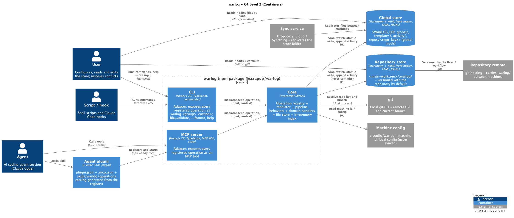
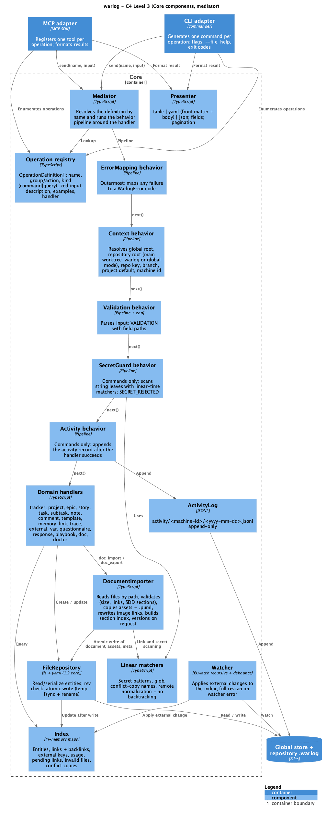

# Technical Plan: warlog

> SDD Phase 2 — the How. Pre-requisite: [`spec.md`](spec.md) (Approved 2026-10-03, amendments 1–2 approved).
> Status: **Approved** (2026-10-03) — Validator.
> Rule IDs `WL-xx` / `SEC-xx` / `P-xx` refer to the spec.

## 1. Architecture Overview

- **Main decision:** one npm package `@scrapup/warlog` holding a **core library** and two thin
  **adapters** (MCP server over stdio, CLI). Every operation is defined once in an **operation
  registry** and executed by a **mediator** that wraps the handler in a shared **behavior pipeline**
  (context, validation, secret guard, activity, error mapping). The adapters never contain business
  rules: they translate transport input into `mediator.send(name, input)` and format the result
  (WL-35).
- **Approach:** local, single-process-per-session tool; no network, no database. Persistence is the
  store folder (one file per entity, atomic writes, optimistic concurrency by `rev`); reads come from
  an in-memory index rebuilt at start and kept current by a file watcher (WL-04, WL-06, WL-41, WL-42).
- **Repository:** `scrapup/warlog` (new, public). Local working copy `~/Develop/scrapup/warlog`.
- **Runtime/stack:** Node.js (development on 24 LTS, `engines: >=22`), TypeScript strict, ESM;
  MCP TypeScript SDK; `zod` (major aligned with the SDK's peer dependency); `yaml` (YAML 1.2 core
  schema); `commander`; `ulid`; `ajv` (variable schemas, restricted keyword set); Jest (`ts-jest`
  ESM preset); ESLint flat config + `typescript-eslint`.

### 1.1 Baseline facts (current tracker, read 2026-10-03 from the `mcp-saga` tool schemas)

| Fact | Consequence for parity (WL-10, WL-11) |
|---|---|
| 41 tools; IDs are `integer` in every schema | warlog IDs are ULID strings — the only deliberate type deviation (WL-11, approved); names and parameter names stay identical |
| `SAGA_PROJECT` env scopes the default project | `WARLOG_PROJECT` with the same role |
| `branch` parameter (`"current"` = active git branch, `""` = branch-agnostic) on epics, dashboard, lists, search, next | Same parameter; epics store `branch`; `"current"` resolved via git by the Context behavior |
| `task_delete` only for `todo` tasks, soft, with `reason`/`deleted_by`; `task_restore` | Same |
| `note_delete` is a hard delete | Soft in warlog (WL-08) + new `note_restore`; documented deviation |
| `force` on `task_update`/`task_batch_update`/`subtask_update` ("only when a human says so", logged) | Same semantics; forced changes flagged in activity |
| `task_lock_description` guards the description | Same (`description_locked` field) |
| `source_ref {file, line_start, line_end, commit, repo}` on tasks | Same field; also indexed as a link of type `relates` to `file:` |
| Note types `general, decision, context, meeting, technical, blocker, progress, release` | Same enum |
| `tracker_export` / `tracker_import` JSON | Import accepts the saga export (WL-14) and remaps integer IDs to ULIDs |

## 2. Solution Diagrams

### 2.1 C4 Level 2 — Containers

 — source [`diagrams/c4-containers.puml`](diagrams/c4-containers.puml)

### 2.2 C4 Level 3 — Core components (mediator)

 — source [`diagrams/c4-components.puml`](diagrams/c4-components.puml)

Pipeline order (outermost first): **ErrorMapping → Context → Validation → SecretGuard → Activity →
handler**. Behaviors declare whether they apply to `command`, `query` or both; SecretGuard and
Activity apply to commands only.

### 2.3 Sequence — write through the mediator (success and failure)

 — source [`diagrams/seq-write.puml`](diagrams/seq-write.puml)

### 2.4 Sequence — repository creation and baseline rollout (success and failure)

 — source [`diagrams/seq-repo-bootstrap.puml`](diagrams/seq-repo-bootstrap.puml)

## 3. Data Model and Persistence

### 3.1 Store layout

Two roots (WL-01, WL-70):

| Root | Location | Holds | Portability |
|---|---|---|---|
| Global | `$WARLOG_DIR` (default `~/.warlog`) | Global memories, vars, questionnaires, templates, global document area, activity of global operations, repository data in **global-root** mode | Sync service |
| Repository | `<main-worktree>/.warlog/` | Everything of repository scope: memories, vars, questionnaires, projects (and their tasks, notes, comments, responses), repository document area, repository activity | git (versioned by default) |

**Repository root resolution (WL-71):** `git rev-parse --path-format=absolute --git-common-dir` →
its parent is the main working tree → `.warlog/` there. Every worktree of the repository resolves to
the same folder. Not a git repository → no repository scope (global only).

**Mode** (repository variable `warlog.storage`, read from the global root under the repo key so it
is known before `.warlog/` is opened): `in-repo` (default; versioned or not depends only on the
User's ignore file — warlog never edits it, WL-72) | `global` (data under
`$WARLOG_DIR/repos/<repo-key>/`, layout below).

`<repo-data>` below = `<main-worktree>/.warlog` (in-repo) or `$WARLOG_DIR/repos/<repo-key>` (global mode).

```
$WARLOG_DIR/                              # default ~/.warlog (WL-01)
  global/
    memories/<ulid>.md
    vars/<name>.yaml
    questionnaires/<slug>.md
    docs/<epic-slug>/<opportunity-slug>/  # global document area (WL-59) — layout in §3.8
  repos/<repo-key>/                       # only in global mode, e.g. github.com__scrapup__scrapup (WL-02); same layout as <repo-data>
    memories/<ulid>.md
    vars/<name>.yaml
    questionnaires/<slug>.md
    docs/<epic-slug>/<opportunity-slug>/  # repository document area (WL-59) — layout in §3.8
    projects/<ulid>/
      project.md
      vars/<name>.yaml
      epics/<ulid>.md
      stories/<ulid>.md
      tasks/<ulid>.md                     # subtasks embedded in front matter
      notes/<ulid>.md
      comments/<task-ulid>/<ulid>.md      # append-only
      responses/<ulid>.md
  templates/<ulid>.md
  activity/<machine-id>/<yyyy-mm-dd>.jsonl  # append-only, per machine (WL-04, WL-18)
~/.config/warlog/                         # local, never synced
  machine-id                              # <hostname>-<random 6>, created once
  config.yaml                             # optional: dir, log level
```

- **Repo key:** remote `origin` (fallback: first remote) normalized by string operations: strip
  scheme/user/`.git`, convert `host:path` (scp form) to `host/path`, lowercase host, `/` → `__`.
  No remote → `local__<dirname>` + warning (WL-03).
- **In-repo layout:** `<repo-data>/` contains `memories/`, `vars/`, `questionnaires/`, `docs/`,
  `projects/<ulid>/…` and `activity/<machine-id>/<yyyy-mm-dd>.jsonl` (per machine and day →
  append-only files never merge-conflict between machines).
- **Merge conflict markers:** a file containing a line starting with `<<<<<<< `, `=======` and
  `>>>>>>> ` (scanned line by line) → excluded, `INVALID_FILE (merge_conflict)` (WL-43).
- **Temp files** `.<name>.tmp-<pid>-<rand>` are ignored by scan/watch and swept by `doctor`.
- **Conflict copies** detected by name: `(conflicted copy`, `.sync-conflict-`, iCloud ` 2.md`/` 2.yaml`
  suffix (WL-43).

### 3.2 Common front matter (all entities)

| Field | Type | Required | Description |
|---|---|---|---|
| `id` | ULID string | Yes | Monotonic ULID generated locally (WL-07) |
| `type` | enum | Yes | `project`, `epic`, `story`, `task`, `note`, `comment`, `memory`, `template`, `questionnaire`, `response`, `doc_epic`, `opportunity`, `document` |
| `rev` | integer ≥ 1 | Yes | Incremented on every write; optimistic concurrency (WL-42) |
| `created_at` / `updated_at` | ISO 8601 UTC | Yes | Inclusion / last-change dates; used for sorting and history, never for conflict detection (WL-46, WL-67) |
| `machine` | string | Yes | Machine id of the last writer |
| `deleted_at` / `deleted_by` / `delete_reason` | ISO 8601 / string | No | Soft delete (WL-08) |
| `tags` | string[] | No | — |
| `links` | `{rel, target}[]` | No | `rel` ∈ `implements, tests, commit, derived_from, supersedes, relates`; `target` = ULID or `spec:<path>#<anchor>`, `git:<sha>`, `test:<path>::<name>`, `file:<path>[:line]`, `url:<url>` (WL-21) |
| `external` | `{system, key, url?}[]` | No | Epic, story, task only (WL-23) |

Body = free Markdown (`description` / `content`).

### 3.3 Entity-specific fields

| Entity | Fields (front matter) |
|---|---|
| project | `name`, `status` (`active, on_hold, completed, archived`) |
| epic | `project_id`, `name`, `status` (`planned, in_progress, completed, cancelled`), `priority` (`low, medium, high, critical`), `branch`, `sort_order`, `archived` |
| story | `project_id`, `epic_id?`, `title`, `code?` (e.g. `US-12`), `status` (epic enum), `priority`, `sort_order` |
| task | `project_id`, `epic_id?`, `story_id?`, `title`, `code?` (e.g. `TF-12-01`), `status` (`todo, in_progress, review, done, blocked`), `priority`, `assigned_to`, `due_date`, `estimated_hours`, `actual_hours`, `depends_on` (ULID[]), `blocked_by_deps` (derived on write), `description_locked`, `source_ref`, `sort_order`, `subtasks: {id, title, status (todo, in_progress, done), depends_on, sort_order}[]` |
| note | `project_id?`, `title`, `note_type` (saga enum), `related_entity_type?`, `related_entity_id?` |
| comment | `task_id`, `author?` |
| template | `name` (unique), `tasks: {title, description?, priority, estimated_hours?, tags?}[]` |
| memory | `scope` (`global, repo`), `kind` (`fact, decision, guardrail, pattern, command, known_issue, runbook`), `title`, `status` (`active, stale, superseded, archived`), `superseded_by?`; kind fields: `pattern` → `applies_to: glob[]`, `example?`; `command` → `cmd`, `purpose` (`run, test, build, lint, debug, logs, deploy, other`), `known_error?`; `known_issue` → `symptom`, `cause?`, `workaround?`, `issue_status` (`open, resolved`), `resolution?`; `runbook` → `purpose` (`run, debug, logs, deploy`), `commands?: ULID[]` (WL-15) |
| questionnaire | `slug`, `title`, `version` (integer), `questions: Question[]` (§3.4) |
| response | `questionnaire`, `questionnaire_version`, `questions` (copy), `subject: {type, id}`, `answers: {question_id: value}` (body renders answers as sections) (WL-31) |

Command status (`works / fails / flaky`, `last_verified_at` per environment) is **derived** from
`command_observed` activity records; never stored in the memory file (WL-18).

### 3.4 Question model (WL-29, WL-30)

| Field | Applies to | Rule |
|---|---|---|
| `id`, `prompt`, `required`, `help?`, `when?` | all | `when`: `{question, equals | not_equals | in, value}` — one condition, no expressions |
| `type` | all | `text`, `long_text`, `single_choice`, `multi_choice`, `checklist`, `list`, `boolean`, `number`, `scale`, `date` |
| `max_length` | text, long_text | default 2 000 / 20 000 |
| `options`, `allow_other` | single_choice, multi_choice | `min`/`max` for multi_choice |
| `items`, `require_all` | checklist | answer = `{item: boolean}` with every item present |
| `min_items`, `max_items` | list | — |
| `min`, `max`, `integer` | number | — |
| `min`, `max`, `min_label`, `max_label` | scale | integer answer |

Built-in `aar` (global, version 1, created on first use if absent): `outcome` single_choice
(success/partial/failure, required), `trigger` text (required), `expected` long_text (required),
`happened` long_text (required), `why_difference` long_text (required, `when outcome != success`),
`sustain` list, `improve` list (WL-33).

### 3.5 Variable file (WL-25..WL-28)

| Field | Type | Required | Description |
|---|---|---|---|
| `name` | string | Yes | Dotted namespace; `[a-z0-9_.-]{1,128}`, no `..` |
| `type` | enum | Yes | `string, number, integer, boolean, array, object` |
| `value` | any | Yes | Must match `type` (and `schema` when present) |
| `schema` | JSON Schema subset | No | Allowed keywords: `type, properties, required, items, enum, const, minimum, maximum, minLength, maxLength, minItems, maxItems, additionalProperties`. `pattern`/`patternProperties`/`format`/`$ref` rejected (caller-supplied regexes violate WL-48) |
| `rev`, `updated_at`, `machine` | — | Yes | As §3.2 |

### 3.6 Activity record (JSONL)

`{ ts, machine, action, entity_type, entity_id, project_id?, repo_key, summary, forced? }` with
`action` ∈ `created, updated, deleted, restored, status_changed, recalled, command_observed, doc_imported, doc_exported`.
`command_observed` adds `{ cmd_memory_id, outcome: ok|fail, exit_code?, env: {os, node?} }`.

### 3.7 Index

Built at start by reading all `.md`/`.yaml` under both roots (global + `<repo-data>`; the 10 000-file SLA applies to their sum) with bounded concurrency (64 open files);
activity files of the last 90 days aggregated for usage and command status. Maps: by ID, by type +
project, children, links + backlinks, external `(system,key) → id`, pending links, invalid files,
conflict copies. Target: **≤ 5 s for 10 000 files** (SLA), asserted by a benchmark test on a
generated store.

**Loading modes (process profile):**

| Process | Mode | Rationale |
|---|---|---|
| MCP server (`warlog mcp`, long-lived) | Full index at start + watcher | Paid once per session; every query served from memory |
| CLI (short-lived, called by hooks/scripts) | **On demand**: point operations (`var_get`, `task_get`, `story_get`, `note_*` by id, `doc_get`, `doc_toc`, `questionnaire_get`, `response_get`) read only the files they need (path derived from id/name + scope); aggregate operations (`tracker_*`, `*_list`, `*_search`, `memory_recall`, `playbook`, `patterns_for`, `trace`, `links_of`, `doctor`, `doc_history`) build the full index first | Avoids the 5 s scan on every hook call |

Each operation declares `load: point | full` in the registry; the CLI adapter honors it, the MCP
adapter ignores it (index always loaded). Write operations in the CLI load the target entity plus the
entities they validate (dependencies, parent) only.

**Latency targets (benchmarks in CI, informative — spec SLA covers indexing only):** CLI
`warlog var get` < 150 ms (p95, warm filesystem); MCP point query < 50 ms; MCP aggregate query on
10 000 files < 300 ms.

### 3.8 Documents (WL-57..WL-69)

```
<area>/docs/<epic-slug>/
  epic.md                                 # type doc_epic: title, links (e.g. to execution epic)
  <opportunity-slug>/
    opportunity.md                        # type opportunity: title, epic, links
    spec.md | plan.md | tasks.md | single-tasks.md | design.md | adr-*.md | <other>.md
    .meta/<kind>.yaml                     # document metadata (below) — content files stay byte-identical except image links
    .meta/<kind>.toc.yaml                 # section index
    assets/<kind>/<relative path of image or .puml>
    versions/<kind>/<n>/                  # immutable snapshot on request (WL-64): document + .meta + assets
```

**Reference mode (WL-73):** `doc_import {path, mode: reference}` stores only `.meta/<kind>.yaml`
(`mode: reference`, `source_path` relative to the repository root, `source_sha256`, `bytes`) and
`.toc.yaml`; no Markdown copy, no assets (image links already resolve inside the repository).
Reads open the live file: hash mismatch → result flagged `changed_since_registration: true`, toc
rebuilt and `.meta` updated (`updated_at`, new hash); file missing → `INVALID_FILE (broken_reference)`
and listed by `doctor`. Allowed only when the source is inside the repository working tree; versioning
(`version: true`) is rejected in reference mode (the repository history is the version history).

`<area>` = `global` or `repos/<repo-key>`. Slugs come from the source folder names
(`docs/specs/<epic>/<opportunity>/`) or from `epic`/`opportunity` parameters; `[a-z0-9-]{1,80}`.

**Document metadata** (`.meta/<kind>.yaml`): `id`, `kind` (`spec, plan, tasks, single-tasks, design,
adr, other`), `title` (first H1), `source_path`, `source_sha256`, `bytes`, `created_at`,
`updated_at`, `version` (current number), `rev`, `machine`, `links`, `assets: {path, sha256,
bytes}[]`, `warnings[]`. Kept beside the Markdown so the document itself is stored as is (WL-63).

**Import pipeline:** resolve path (file or opportunity folder) → infer area/epic/opportunity/kind →
read files with size checks (2 MB Markdown, 10 MB asset — WL-65) → parse Markdown headings and
image links (CommonMark link syntax, linear scanner) → resolve each relative image inside the
source folder tree (reject `..` escapes, absolute paths, `http(s):`/`data:` — WL-62, WL-69) →
include the sibling `.puml` of each image when present (WL-61) → SDD checks by kind → secret scan
→ if `version: true` snapshot current state to `versions/<kind>/<n>/` → write assets, document,
`.meta`, `.toc` atomically (document last) → update `opportunity.updated_at`/`epic.updated_at` →
activity `doc_imported`.

**Link rewriting (WL-61):** `` → ``; the
relative structure is preserved under `assets/<kind>/`, so viewers resolve it from the stored file.
Non-image links are untouched.

**SDD checks by kind:** `spec` → H2 sections Overview, User Journeys, Business Rules, Edge Cases,
Success Criteria, Glossary (matched by number prefix `## 1.`..`## 6.`, English or Portuguese titles);
`plan` → Architecture, Diagrams, Data, Contracts, Resilience, Justification (`## 1.`..`## 6.`);
`tasks`/`single-tasks` → at least one `## US-\d+` and `#### TF-\d+-\d+` headings, TF prefix
matching its US, `single-tasks` ≤ 5 TF. Failures of SDD checks are errors for `spec/plan/tasks/
single-tasks`; `design/adr/other` get only generic checks. Opportunity rule: `tasks` and
`single-tasks` together → `VALIDATION` (WL-58).

**Section index and pagination (WL-66):** `.toc.yaml` = heading tree `{level, title, anchor,
byte_start, byte_end, bytes}`. `doc_get` returns the whole document only when ≤ 500 KB; above it,
returns the toc + page 1. Page = consecutive whole sections up to **100 KB** (a single section
larger than 100 KB is split at paragraph boundaries). `doc_get {section: <anchor>}` returns one
section (with its subsections).

### 3.9 Migrations

None (new store). Import of a saga export is an operation (`tracker_import`), not a migration.

## 4. Integration Contracts

### 4.1 Operation definition (registry entry)

| Property | Description |
|---|---|
| `name` | snake_case tool name (e.g. `task_update`) — MCP tool name |
| `group`, `action` | CLI path `warlog <group> <action>` (`task`, `batch-update`) |
| `kind` | `command` (writes) or `query` (reads) |
| `input` | zod schema — single source for MCP `inputSchema`, CLI flags, file validation and help |
| `description`, `examples` | Help text and an example input (YAML) per operation (WL-37) |
| `defaultFormat` | `table` (lists) or `yaml` (single entity) (WL-38) |
| `load` | `point` or `full` — CLI loading mode (§3.7) |
| `handler` | `(input, context) → result` — domain logic only |

A registry test fails if any entry lacks description/example or if two entries share a name or CLI
path.

### 4.2 Operation catalog

**Parity (WL-10):** `tracker_init`, `tracker_dashboard`, `tracker_next`, `tracker_search`,
`tracker_session_diff`, `tracker_export`, `tracker_import`, `activity_log`, `project_create`,
`project_list`, `project_update`, `epic_create`, `epic_list`, `epic_update`, `epic_archive`,
`task_create`, `task_get`, `task_list`, `task_update`, `task_delete`, `task_restore`, `task_reorder`,
`task_batch_update`, `task_lock_description`, `subtask_create`, `subtask_update`, `subtask_delete`,
`subtask_reorder`, `note_save`, `note_list`, `note_search`, `note_delete`, `comment_add`,
`comment_list`, `comment_delete`, `comment_restore`, `template_create`, `template_list`,
`template_update`, `template_delete`, `template_apply` — same parameter names, enums and defaults as
§1.1. `task_create` additionally accepts `story_id`; `epic_id` becomes optional when `story_id` is
given (WL-12).

**New:**

| Group | Operations | Notes |
|---|---|---|
| story | `story_create`, `story_get`, `story_list`, `story_update`, `story_archive` | WL-12 |
| note | `note_restore` | Soft-delete counterpart |
| memory | `memory_save`, `memory_get`, `memory_list`, `memory_recall`, `memory_supersede`, `memory_mark_stale`, `memory_archive`, `memory_review` | `memory_recall {query, kind?, scope?, tags?, limit}`: literal token match on title/body/tags (WL-47), rank = scope specificity → match count → recency; appends `recalled` activity (WL-16..WL-18) |
| playbook | `playbook {topic?}`, `patterns_for {path}`, `command_record {cmd, outcome, exit_code?, error?, purpose?}`, `issue_resolve {id, resolution, link?}` | WL-19, WL-20 |
| link | `link_add`, `link_remove`, `links_of {id, direction}`, `trace {id, depth?}` | WL-21, WL-22 |
| external | `external_link`, `external_unlink`, `find_by_external {system, key}` | WL-23 |
| var | `var_set {name, value, type?, scope, schema?, force?}`, `var_get {name, path?, scope?}`, `var_list {scope?, effective?}`, `var_delete {name, scope}` | `var_get` returns `{value, type, scope}` (WL-25..WL-28) |
| questionnaire | `questionnaire_define`, `questionnaire_get`, `questionnaire_list` | Redefining bumps `version` |
| response | `response_create`, `response_get`, `response_list`, `response_promote {response_id, question_id, item_index?, kind, scope}` | WL-31, WL-32 |
| health | `doctor` | WL-45 |
| doc | `doc_import {path, area: repo\|global, mode?: copy\|reference, epic?, opportunity?, kind?, version?: bool, validate_only?: bool}`, `doc_get {id \| (area, epic, opportunity, kind), section?, page?, version?}`, `doc_toc {id}`, `doc_search {query, id? \| epic? \| opportunity?}`, `doc_list {area, epic?, opportunity?, kind?, sort_by: created_at\|updated_at, order}`, `doc_history {area, epic?, opportunity?, since?, until?}`, `doc_versions {id}`, `doc_export {id, dest, version?}`, `doc_epic_list`, `opportunity_list {area, epic?, sort_by}` | WL-57..WL-69; summaries only — content returned only by `doc_get`/`doc_search` |

**Common read parameters:** `format` (`table | yaml | json`), `fields` (string[]), `limit`,
`cursor` (opaque, ULID-based). List rows omit bodies by default (WL-38).

### 4.3 MCP adapter

- One `registerTool(name, { description, inputSchema }, handler)` per registry entry; server name
  `warlog`, version from `package.json`. Started by `warlog mcp` (stdio). **stdout carries only MCP
  frames; all logs go to stderr.**
- Result: `content: [{ type: "text", text: <presented result> }]`. Errors: `isError: true`, text
  `"<CODE>: <message>"` followed by YAML details (field paths, current state on `CONFLICT`).
- Plugin registration (consumer side, informative): `{"mcpServers": {"mcp-warlog": {"command":
  "npx", "args": ["-y", "@scrapup/warlog@<version>", "mcp"]}}}`.

### 4.4 CLI adapter

| Aspect | Contract |
|---|---|
| Path | `warlog <group> <action>`; `warlog mcp` starts the server; `warlog doctor` |
| Flags | Generated from the zod schema: `--kebab-case`; arrays as repeated flags or comma lists; objects only via `--file` or `--json-input '<json>'` |
| File input | `--file <path>` / `--file -`; `.yaml`/`.yml`/`.json`; `.md` → front matter = fields, body = `description`/`content`. Merge order: file < flags. Parsed with YAML 1.2; errors carry `file:line:col field: message` (WL-36) |
| `--validate` | Runs Context + Validation + SecretGuard, skips handler; exit 0 or 3 |
| `--format` | `table | yaml | json`; `var get` prints scalars raw (WL-39) |
| Help | `--help` at root, group and operation level from registry (parameters with type, required, default, description; example input file) (WL-37) |
| Exit codes | `0` ok · `1` error / `SECRET_REJECTED` / `INVALID_FILE` / `NO_REPO_CONTEXT` · `2` `NOT_FOUND` · `3` `VALIDATION` · `4` `CONFLICT` (WL-39, WL-40) |

### 4.5 Errors (WL-40)

`WarlogError { code, message, details? }`, `code` ∈ `NOT_FOUND, VALIDATION, CONFLICT, INVALID_FILE,
SECRET_REJECTED, NO_REPO_CONTEXT`. Any other exception → `INTERNAL` (exit 1), message without stack
unless `WARLOG_LOG_LEVEL=debug`.

### 4.6 Agent plugin and skill (WL-74, WL-75)

| File | Content |
|---|---|
| `.claude-plugin/plugin.json` | `name: warlog`, version synchronized by release-please (`$.version`), `skills: ["./skills"]` |
| `.claude-plugin/marketplace.json` | Self-marketplace (`$.metadata.version` synchronized), single plugin entry |
| `.mcp.json` | `{"mcpServers": {"mcp-warlog": {"command": "npx", "args": ["-y", "@scrapup/warlog@<version>", "mcp"]}}}` — version marker updated by release-please (`extra-files`) |
| `skills/warlog/SKILL.md` | Frontmatter `name: warlog`, trigger description (resume work, track execution, record/recall lessons, AAR, playbook, toggles, register/read docs by path, trace). Body: scopes and storage (`.warlog/` versioned, global root), decision table "intent → operation group", usage rules (deliberate recording; no secrets; prefer `doc_get` by section/page and `doc_import` by path; on `CONFLICT` re-read and re-apply; `force` only on explicit human authorization; never commit `.warlog/` unless the workflow says so) |
| `skills/warlog/references/operations.md` | Generated by `npm run gen:skill` from the registry: per operation name, CLI path, kind, parameters (type, required, default), description, example. Test `skill-catalog.test.ts` regenerates in memory and fails on any diff |

The skill is reviewed with the `reviewer-prompt-engineering` lens before the first release.

### 4.7 Repository creation and baseline (WL-50..WL-56, SEC-01..SEC-31)

`$R` = `scrapup/warlog`.

**Phase 0 — pre-checks:** `gh auth status`; `gh api orgs/scrapup/memberships/$(gh api user --jq .login) --jq .role` = `admin`;
`gh repo view $R` must fail with "Could not resolve".

**Phase 1 — bootstrap (WL-51, WL-52):**

```bash
cd ~/Develop/scrapup/warlog
git init -b main
# LICENSE (MIT © 2026 scrapup), README.md (name + one-line description), .gitignore (node_modules, dist, coverage, .warlog-test)
git add LICENSE README.md .gitignore
git commit -m "chore: bootstrap repository"
gh repo create scrapup/warlog --public \
  --description "File-based memory and execution ledger for AI coding agents" \
  --source . --remote origin --push
```

`docs/` stays untracked until Phase 4 (enters through the first PR).

**Phase 2 — settings (SEC-06, SEC-09..SEC-11, SEC-17, SEC-20):**

```bash
gh api -X PATCH repos/$R \
  -F has_issues=true -F has_projects=false -F has_wiki=false -F has_discussions=false \
  -F allow_squash_merge=true -F allow_merge_commit=false -F allow_rebase_merge=false \
  -f squash_merge_commit_title=PR_TITLE -f squash_merge_commit_message=COMMIT_MESSAGES \
  -F allow_auto_merge=false -F delete_branch_on_merge=true
gh api -X PUT repos/$R/actions/permissions/workflow \
  -f default_workflow_permissions=read -F can_approve_pull_request_reviews=true
gh api -X PUT repos/$R/actions/permissions -F enabled=true -f allowed_actions=selected
gh api -X PUT repos/$R/actions/permissions/selected-actions --input - <<'JSON'
{ "github_owned_allowed": true, "verified_allowed": false,
  "patterns_allowed": [ "amannn/action-semantic-pull-request@*", "googleapis/release-please-action@*" ] }
JSON
gh api -X PUT repos/$R/actions/permissions/fork-pr-contributor-approval \
  -f approval_policy=all_external_contributors
gh api -X PUT repos/$R/vulnerability-alerts
gh api -X PUT repos/$R/automated-security-fixes
gh api -X PUT repos/$R/private-vulnerability-reporting
gh api -X PATCH repos/$R --input - <<'JSON'
{ "security_and_analysis": {
    "secret_scanning": { "status": "enabled" },
    "secret_scanning_push_protection": { "status": "enabled" } } }
JSON
gh api -X PUT orgs/scrapup/teams/scrapup/repos/$R -f permission=push   # SEC-07 (Validator decision, pre-approved here)
```

`can_approve_pull_request_reviews=true` matches the organization reference (release-please needs
it to open Release PRs from `GITHUB_TOKEN`).

**Phase 2' — human-only (SEC-29):** Validator enables the dependency graph in the UI (Settings →
Advanced Security). Evidence: `gh api repos/$R/dependency-graph/sbom` returns 200.

**Phase 3 — rulesets before the first PR (SEC-01, SEC-03, SEC-04, SEC-08, SEC-26):**

| Ruleset | Target | Rules | Bypass |
|---|---|---|---|
| `main-review` | `~DEFAULT_BRANCH` | `pull_request`: 1 approval, code-owner review, dismiss stale, thread resolution, merge `squash` | Repository admin (`actor_id` 5), `pull_request` mode |
| `main-integrity` | `~DEFAULT_BRANCH` | `deletion`, `non_fast_forward`, `required_linear_history`, `pull_request` (0 approvals, merge `squash`); **no `required_status_checks` yet** (SEC-27) | None |
| `release-tags` | `refs/tags/v*` | `update`, `deletion` | None |

Bodies identical to the organization reference (`main-review`, `main-integrity` step 1 without the
checks rule, `release-tags`). Probe: `git push origin HEAD:main` with an empty commit → rejected.

**Phase 4 — first PR (WL-54, SEC-28):** branch `docs/initial-specification` from `origin/main`,
title `docs: add warlog specification and repository governance`. Files:

| File | Content |
|---|---|
| `docs/specs/warlog/{spec,plan,tasks}.md`, `diagrams/*.puml|png` | This specification set |
| `.github/CODEOWNERS` | `* @scrapup/scrapup` |
| `SECURITY.md` | Supported: latest minor of `@scrapup/warlog` (npm); no public issues/discussions/PRs for vulnerabilities; report via `https://github.com/scrapup/warlog/security/advisories/new`; fix released first, advisory published after (SEC-20) |
| `.github/dependabot.yml` | `github-actions` + `npm` at `/`, weekly Monday, `open-pull-requests-limit: 5`, prefixes `ci(deps)` / `chore(deps)` (SEC-14) |
| `.github/workflows/pr-title.yml` | Job `validate`: `amannn/action-semantic-pull-request` SHA-pinned, types of SEC-05; `permissions: {}` top, job `pull-requests: read` |
| `.github/workflows/dependency-review.yml` | Job `dependency-review`: `actions/dependency-review-action` SHA-pinned, `fail-on-severity: moderate`, `comment-summary-in-pr: on-failure`; job `contents: read`, `pull-requests: write` (SEC-18) |
| `.github/workflows/release-please.yml` | Job `release-please` on `push: main`: release-please SHA-pinned; on release: checkout, setup-node (registry npmjs), `npm ci --ignore-scripts`, `npm run build`, `npm publish --provenance --access public`; job `contents: write`, `pull-requests: write`, `id-token: write` (SEC-31, P-05) |
| `release-please-config.json`, `.release-please-manifest.json` | `release-type: node`, `bump-minor-pre-major: true`, `include-component-in-tag: false`; `extra-files`: `.claude-plugin/plugin.json` (`$.version`), `.claude-plugin/marketplace.json` (`$.metadata.version`), `.mcp.json` (generic marker); manifest `0.0.0` |
| `README.md`, `README.pt.md`, `README.ja.md` (WL-76) | First line `🌐 [English](./README.md) \| [日本語](./README.ja.md) \| [Português](./README.pt.md)` with the current language bold and unlinked. Sections (identical in the three): what warlog is; status (pre-release); install (npm + Claude Code plugin); quick start (`warlog --help`, `warlog var get`, MCP registration); storage model (global root vs `.warlog/`); security note (no secrets); contributing link; license. Technical terms kept in English in PT/JA (*skill*, *commit*, *pull request*, *worktree*) |
| `CLAUDE.md` (WL-76) | Agent guide to contribute and maintain: purpose and non-goals; architecture (registry → mediator → behaviors → handlers; ports/adapters; composition roots); where things live; npm scripts; conventions — English artifacts, Conventional Commits, explicit file-by-file staging, no agent co-author trailer, JSDoc on everything, 95 % unit coverage, rule IDs in test titles, README EN→PT/JA in the same commit, never bump versions by hand; how to add an operation (definition + handler + tests + regenerate skill catalog); release flow |
| `CONTRIBUTING.md` (WL-76) | Human contribution guide: prerequisites (Node from `.nvmrc`), setup (`npm ci --ignore-scripts`), branch + PR flow (Conventional Commit title, squash merge, code-owner review), local checks mirroring `verify`, Definition of Done (§7.4), how to report vulnerabilities (→ `SECURITY.md`), license of contributions (MIT) |

Every `uses:` pinned to a full SHA with `# vX.Y.Z` comment, latest release of the current major
(SEC-12, SEC-13); SHA resolved with `gh api repos/<o>/<r>/git/ref/tags/<tag>` (dereference
annotated tags). CodeQL default setup enabled once the PR exists:
`gh api -X PATCH repos/$R/code-scanning/default-setup -f state=configured -f query_suite=default -f 'languages[]=actions'`
(`javascript-typescript` added when the first TS code lands — CodeQL rejects a language with no
source).

**Phase 5 — required checks (SEC-02, SEC-19, SEC-27):** after `validate` and `dependency-review`
reported on the PR head and the first CodeQL analysis exists, `PUT` `main-integrity` adding
`required_status_checks` (`strict: true`; `validate`, `dependency-review`; `integration_id` 15368)
and the `code_scanning` rule (`CodeQL`, `security_alerts_threshold: high_or_higher`,
`alerts_threshold: errors`). Validator approves/merges with the admin bypass.

**Phase 6 — probes (evidence):** PR titled `update stuff` → `validate` fails, retitled → passes;
`reviewDecision = REVIEW_REQUIRED` with bypass only at merge; direct push rejected; ruleset bodies,
settings and security features read back and tabulated against SEC-01..SEC-31.

**README maintenance:** each feature task that changes user-visible behavior updates the three READMEs in the same commit; `CLAUDE.md` is updated when architecture, scripts or conventions change.

**Phase 7 — `verify` (P-03, at the first code PR):** `.github/workflows/ci.yml` job `verify`
(`contents: read`, OS matrix): checkout, setup-node from `.nvmrc`, steps of §7.5 (SEC-15); CodeQL language
`javascript-typescript` added; after `verify` reports once, it is added to `main-integrity`.

## 5. Resilience, Security and Error Handling

### 5.1 Failure matrix

| Component | Failure | Strategy | User impact |
|---|---|---|---|
| Store root | Missing / not writable | Create on first start; if creation fails, exit with path and errno | Tool unusable until fixed (fail fast) |
| FileRepository | Concurrent update | `rev` check at write → `CONFLICT` with current state | Caller re-reads and retries |
| FileRepository | Crash mid-write | temp + `fsync` + `rename` in the same directory | Old content intact |
| FileRepository | Two creates of the same name (vars, questionnaires) on two machines | Sync produces a conflict copy → reported by `doctor` | Human resolves |
| Watcher | Event loss / `EMFILE` / unsupported platform | Debounced full rescan; on watcher error fall back to rescan every 5 s | Slightly stale view (seconds) |
| Index | File parse error | Excluded, listed as `INVALID_FILE` | Other data unaffected |
| Index | Link target missing | Pending link | Reported; task stays blocked |
| git | Not a repo / no remote / git missing | `local__<dir>` scope + warning; `NO_REPO_CONTEXT` only for repo-scoped writes when no working directory is known | Local-only data |
| Activity log | Append fails | Write already committed; error logged to stderr, operation still returns success with a warning | Usage stats may miss one record |
| Import | Malformed export | Validate whole payload before any write | Nothing imported |

### 5.2 Security

- **No network, no credentials** (WL-09, WL-24); the package makes no outbound calls.
- **Validation at the edge:** every input through zod (strict objects, unknown keys rejected); file
  contents validated by the same schema as on read; parsers fail closed (SEC-23).
- **Secret guard:** fixed, anchored, bounded patterns over every string leaf of a command input and
  of variable values: `ghp_|gho_|ghu_|ghs_|ghr_` + 36 alnum, `github_pat_` + 82 `[A-Za-z0-9_]`,
  `npm_` + 36 alnum, `sk-` + ≥ 20 (bounded 200) `[A-Za-z0-9_-]`, `xox[abprs]-` tokens, `AKIA` + 16
  `[A-Z0-9]`, `-----BEGIN ... PRIVATE KEY-----` header. Matched by index scans for prefixes then
  bounded character-class checks (SEC-21).
- **Linear matchers (WL-48):** glob `applies_to` via iterative wildcard matcher with pattern length
  ≤ 256 (`O(n·m)`, `m` bounded) — no regex generation; conflict-copy and remote normalization by
  string operations; search is literal token matching (WL-47); YAML parser with alias/anchor limit
  (`maxAliasCount: 100`) against billion-laughs. Adversarial tests: inputs ≥ 20 000 chars under
  200 ms each (SEC-22).
- **Document import paths (WL-69):** repository area — source must be inside `git rev-parse
  --show-toplevel` of the working directory; global area — inside the working tree or under a root
  listed in the global variable `docs.import.allowed_roots` (array). Symlinks resolved with
  `realpath` before the check. `doc_export` destination follows the same rule and never overwrites
  without `overwrite: true`.
- **Path confinement (WL-49):** IDs must match the ULID alphabet; names/slugs `[a-z0-9_.-]`, no
  `..`; every resolved path checked with `path.relative(root, p)` not starting with `..`.
- **Supply chain:** dependencies pinned via lockfile; `npm ci --ignore-scripts` in CI; no
  `postinstall` in the package; publish with provenance.

### 5.3 Observability

Local CLI/MCP tool — no OpenTelemetry/exporters (no network by design). Instead:

| Type | Name / pattern | When | Purpose |
|---|---|---|---|
| Log (info, stderr, JSON) | `index.built {files, ms, invalid, conflicts}` | Start | Verify the 5 s SLA in the field |
| Log (warn) | `repo.local_scope {dir}` | No remote | Portability warning |
| Log (warn) | `watcher.fallback {reason}` | Watcher error | Diagnose stale views |
| Log (error) | `op.failed {op, code}` | Error mapping | Debug (`WARLOG_LOG_LEVEL`) |
| Health | `doctor` report | On demand | Conflict copies, invalid files, pending links, review candidates, temp files |
| Audit | activity JSONL | Every command | Who/what/when per machine |

No input values are logged (may contain user content); only operation names, codes, counts.

## 6. Justification and Trade-offs

| Decision | Discarded alternative | Justification |
|---|---|---|
| Plain TypeScript + own mediator (registry + pipeline, ~150 lines) | NestJS (+ `@nestjs/cqrs`, `nest-commander`) | Validator decision (2026-10-03). Measured on Node 22.22: minimal Nest application context 143 ms/exec vs 29 ms for plain Node (+~110 ms on **every** CLI call made by hooks); +20 packages / 17 MB on a public `npx` package (SEC-14..SEC-18); decorator metadata friction with ESM + `ts-jest`; no official MCP integration; NestJS targets long-running HTTP/queue services, warlog is a library + local CLI |
| Own mediator | Generic mediator library ports | Two adapters only; full control of pipeline order |
| CLI on-demand loading | Full index on every CLI call | Hooks call the CLI often; full scan is reserved for aggregate operations |
| One package, `warlog mcp` sub-command | Separate packages for CLI and server | Single version, one install, parity guaranteed by construction |
| `.warlog/` in the repository, versioned by default | All data in the synced global folder | Repository knowledge and execution state travel and are audited with the code (Validator decision); one file per entity + per-machine activity keep merges small |
| Shared `.warlog/` of the main worktree | One `.warlog/` per worktree | Parallel executors would diverge and merge state later (WL-71) |
| Plain files + in-memory index | SQLite in the synced folder | SQLite in sync folders corrupts; files are diffable, editable, sync-friendly |
| No persisted index | Cached index file | Would be the first conflict hotspot across machines; 10 000 files fit the 5 s SLA |
| `fs.watch` recursive + rescan fallback | `chokidar` | Native recursive watch on macOS/Windows/Linux (Node ≥ 20); fewer dependencies |
| `yaml` 1.2 core schema | `js-yaml` (1.1 semantics by default) | Avoids `no`/`off`/octal coercion (WL-28) |
| `ajv` with restricted keywords | Full JSON Schema | Caller-supplied `pattern` would break WL-48 |
| ULID strings | Integer IDs as in saga | Coordination-free uniqueness across machines (WL-07, WL-11) |
| Literal token search | Regex or embeddings | WL-47; embeddings out of scope |
| Document metadata in `.meta/` beside an untouched Markdown | Front matter injected into the document | WL-63: content stored as is; the stored file stays identical to the source except image links |
| Pages of 100 KB aligned to sections | Fixed byte pages | Pages never cut a section mid-way unless the section alone exceeds the page |
| Jest + `ts-jest` ESM | Vitest | Validator decision |
| Command status derived from activity | Status field in the memory file | Each observation would rewrite the file and create sync conflicts (WL-18) |
| Bootstrap direct push | Empty repo + PR | A PR needs a base branch; single, documented exception (WL-52) |

**Waivers (SEC-30):** none.

## 7. Engineering Standards and Proof

### 7.1 Documentation (JSDoc)

Every class, constructor, method, function, property/attribute, interface/type member and enum
member has a JSDoc block: summary; `@param` for each parameter; `@returns`; `@throws` listing the
`WarlogError` codes it can raise; `@example` on registry operations. Enforced by
`eslint-plugin-jsdoc` (`require-jsdoc` with `publicOnly: false` and contexts `ClassDeclaration`,
`MethodDefinition`, `PropertyDefinition`, `TSPropertySignature`, `TSInterfaceDeclaration`,
`TSTypeAliasDeclaration`, `TSEnumMember`, `FunctionDeclaration`, `ArrowFunctionExpression` in
variable declarations; `require-param`, `require-returns`, `check-param-names`, `no-undefined-types`)
— lint errors fail `verify`.

### 7.2 Single responsibility and dependency injection

- **Ports** (interfaces) for every side effect: `FileSystem`, `Clock`, `IdGenerator`, `GitClient`,
  `MachineIdProvider`, `Env`, `Logger`, `Watcher`. Adapters: `NodeFileSystem`, `SystemClock`,
  `UlidGenerator`, `GitCliClient`, etc.
- **Constructor injection only**; no DI container, no module-level singletons, no `new` of a
  collaborator inside a unit. One **composition root** per entry point (`compose-mcp.ts`,
  `compose-cli.ts`) wires the graph.
- One handler class per operation; one behavior class per pipeline concern; one repository per
  entity family; adapters contain no domain rule (WL-35).
- Guard rails in ESLint: `max-classes-per-file: 1`, `complexity: 10`, `max-lines-per-function: 60`,
  `max-lines: 300`, `no-restricted-imports` (domain/handlers may not import `node:fs`,
  `node:child_process` or adapters — only ports). `@typescript-eslint/no-explicit-any: error`.

### 7.3 Test layers (Jest projects)

| Project | Scope | Doubles | Gate |
|---|---|---|---|
| `unit` | Every class/function in isolation: validators, matchers, behaviors, handlers, presenter, repositories (with in-memory `FileSystem`), adapters' mapping logic | Fakes for all ports | `coverageThreshold.global` = **95** for statements, branches, functions, lines — computed from this project alone |
| `integration` | Mediator + real `NodeFileSystem` in a temp dir + real `git` in a temp repository (+ worktree); watcher; concurrency (two processes); sync-conflict and merge-marker simulation; document import (copy/reference); saga parity contract | None for fs/git | All pass |
| `e2e-cli` | Built package (`npm pack` → installed in a temp prefix) invoked as a process: every operation through `warlog <group> <action>`, `--file`, `--validate`, `--format`, help snapshots, exit codes | None | All pass |
| `e2e-mcp` | `warlog mcp` spawned and driven by the MCP SDK `StdioClientTransport`: `tools/list` equals the registry, every tool called with valid and invalid input, error shape, no stdout pollution | None | All pass |
| `bench` | Index 10 000 files ≤ 5 s; CLI `var get` < 150 ms; MCP query targets (§3.7) | None | SLA (index) blocking; others reported |

Interface parity test: for each registry entry, the CLI command and the MCP tool exist with the same
required parameters (WL-35), and the same input yields the same normalized result through both.

### 7.4 Proof of every rule ("every implementation is proven")

- Test titles carry the rule IDs they prove: `it('[WL-42] rejects an update with a stale rev', …)`.
- `npm run rules:coverage` parses `docs/specs/warlog/spec.md` for code-level rules (`WL-01..WL-49`,
  `WL-57..WL-75`, `SEC-21..SEC-24`) and the Jest JSON report for titles; fails if a rule has no passing test, and
  writes `docs/evidence/rules-coverage.md` (rule → tests).
- Repository and process rules (`WL-50..WL-56`, `WL-76`, `SEC-01..SEC-20`, `SEC-25` — CodeQL triage log, `SEC-26..SEC-31`) are proven by `docs/evidence/repository-baseline.md`
  (platform reads + probe results, phase 6 of §4.7).
- **Definition of Done of every task:** JSDoc complete; unit coverage ≥ 95 %; rule IDs of the task
  proven by named tests; integration/e2e updated when the task touches a flow; `verify` green;
  evidence (command + output summary) attached to the task.

### 7.5 `verify` job (P-03)

`npm ci --ignore-scripts` → `npm run typecheck` → `npm run lint` (incl. JSDoc + SRP rules) →
`npm run test:unit -- --coverage` (95 % gate) → `npm run build` → `npm run test:integration` →
`npm run test:e2e` (CLI + MCP, from the packed tarball) → `npm run rules:coverage` →
`npm run bench -- --ci`. Coverage and rules-coverage summaries written to `$GITHUB_STEP_SUMMARY`.
Matrix: `ubuntu-latest`, `macos-latest`, `windows-latest` (file watching, rename atomicity and paths
differ per OS); required check names frozen as `verify (ubuntu-latest)`, `verify (macos-latest)`,
`verify (windows-latest)`.

## 8. Execution Order (input for `tasks.md`)

1. Repository creation, settings, rulesets, first PR with docs + governance (§4.7 phases 0–6).
2. Project scaffold + `verify` CI (phase 7): package, TS strict, ESLint, Jest, build, `bin`.
3. Core foundation: ULID, path confinement, linear matchers, YAML I/O, FileRepository (atomic,
   `rev`), activity log, machine id, repo key.
4. Mediator + registry + behaviors + presenter + error model.
5. Adapters: MCP server and CLI generator (help, `--file`, `--validate`, exit codes) with the
   parity-of-interfaces test.
6. Index + watcher + `doctor` (scan SLA benchmark).
7. Parity domain: project/epic/story/task/subtask/note/comment/template/tracker/activity +
   export/import + saga parity contract test.
8. Variables.
9. Knowledge: memories, lifecycle, recall, playbook, `command_record`, `patterns_for`, issues.
10. Links, trace, external references.
11. Questionnaires, responses, promotion, built-in AAR.
12. Documents: import (file/folder), assets + link rewriting, SDD checks, versions, toc/pagination,
    search, list/history sorting, export.
13. Agent plugin + skill (WL-74, WL-75): `.claude-plugin/plugin.json`, `.mcp.json`,
    `skills/warlog/SKILL.md`, generated `skills/warlog/references/operations.md`, drift test.
14. First release `v0.1.0` (Release PR merged by the Validator; npm provenance verified).
