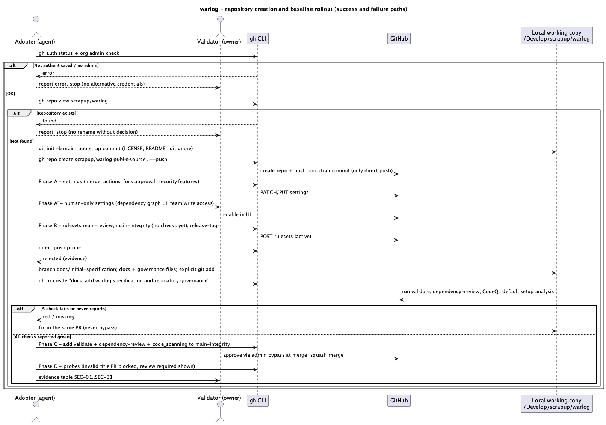
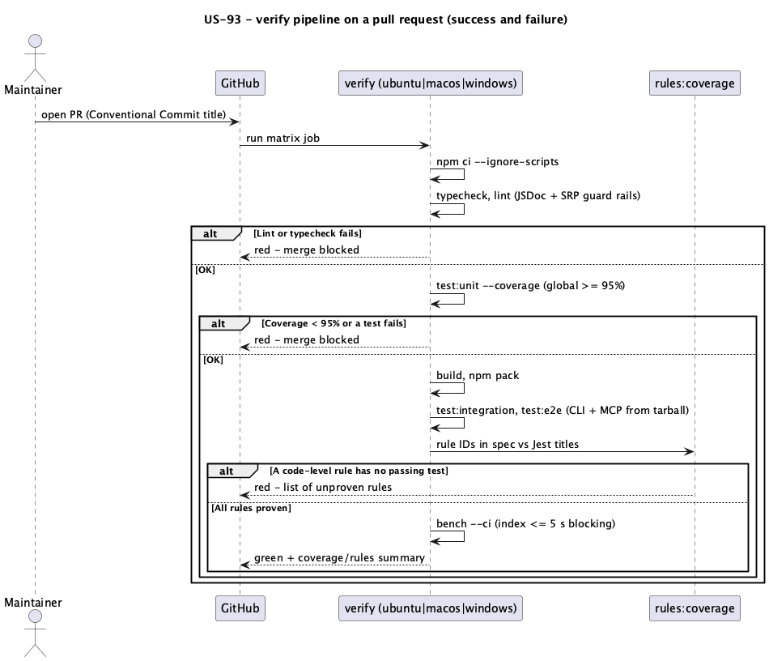
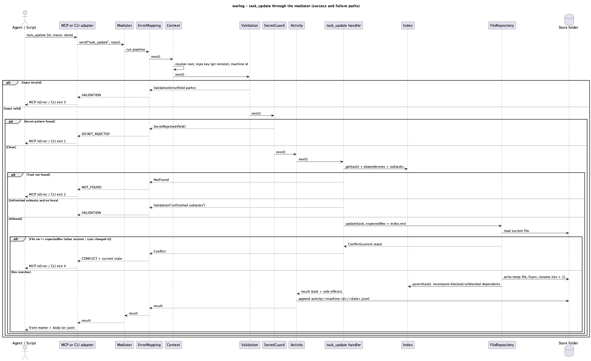
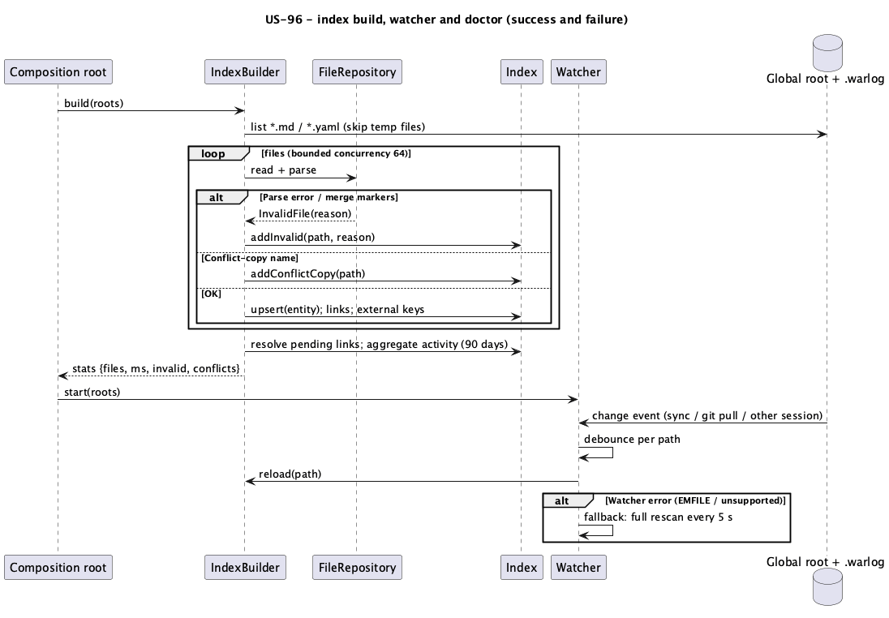
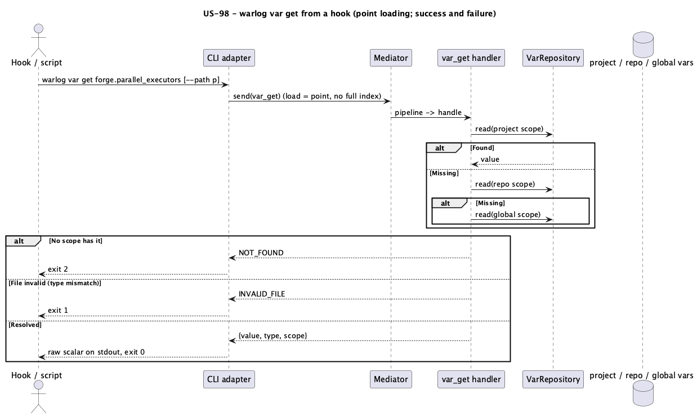
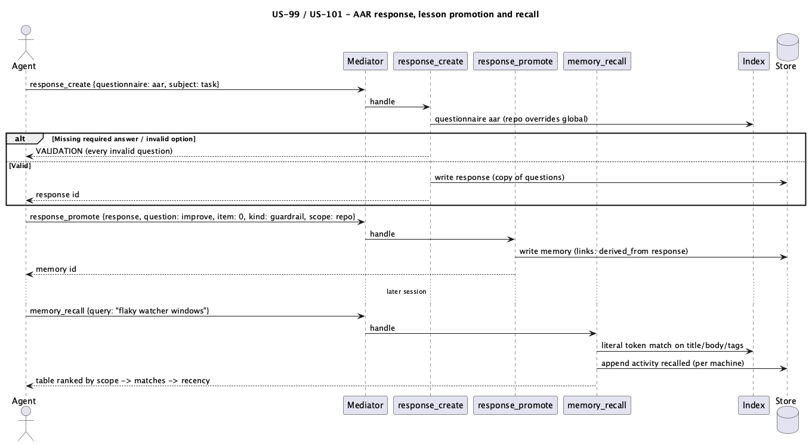
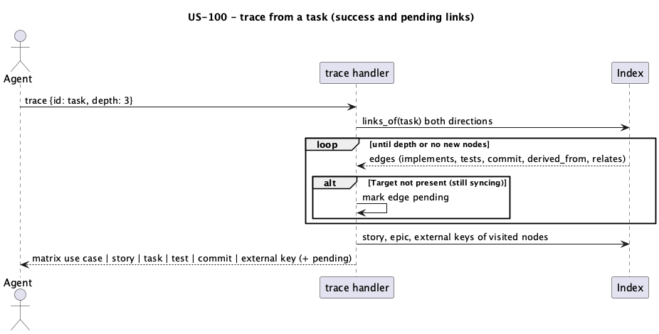
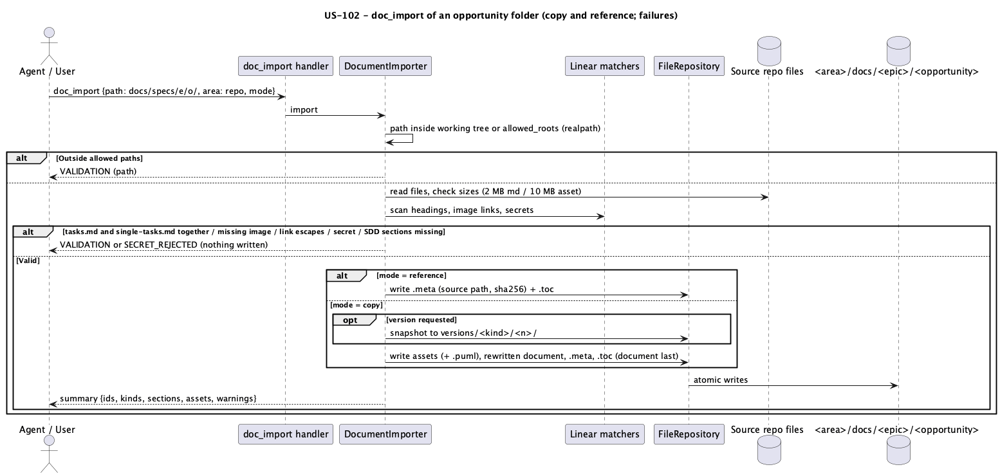
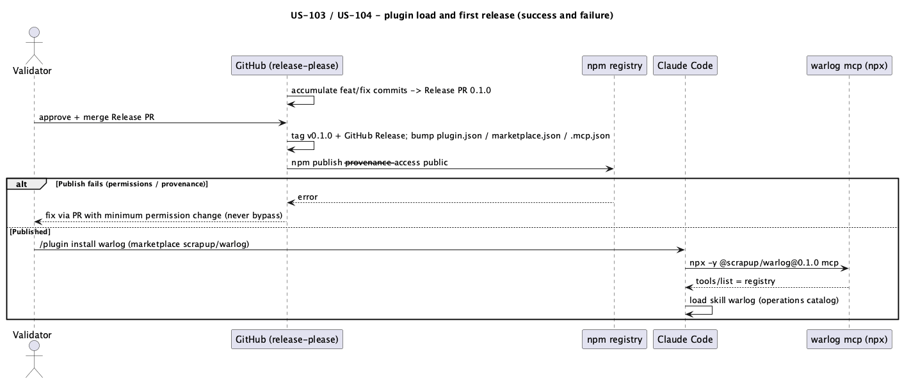

# Execution Backlog: warlog

> SDD Phase 3. Pre-requisites: [`spec.md`](spec.md) (Approved, amendments 1–2) and [`plan.md`](plan.md)
> (Approved), 2026-10-03. Status: **Approved** (2026-10-03) — Validator.

## Reference Epic

**Epic:** warlog — file-based memory and execution ledger for AI agents (internal; no PM epic).
**System:** `scrapup/warlog` (new public repository; local working copy `~/Develop/scrapup/warlog`).

## Conventions for every task

- **Definition of Done (plan §7.4), implicit in every code task:** JSDoc on every class, method,
  function, property and type member; unit coverage of the touched code ≥ 95 % and global gate green;
  every rule ID the task lists has a test whose title starts with `[<RULE-ID>]`; integration/e2e
  updated when the task touches a flow; `npm run verify:local` green on the developer machine and the
  `verify` matrix green on the PR; evidence (command + summary of output) recorded on the task.
- **Architecture (plan §7.2):** ports for side effects, constructor injection, one handler per
  operation, adapters without domain rules, ESLint guard rails (no `any`, complexity ≤ 10, function
  ≤ 60 lines, file ≤ 300 lines, one class per file).
- **Git (WL-55):** one branch + PR per task (or per user story when the tasks are tightly coupled,
  stated in the task), Conventional Commit PR title, explicit file-by-file staging, no agent
  co-author trailer, never `--no-verify`, never bump versions by hand.
- **README (WL-76):** a task changing user-visible behavior updates `README.md`, `README.pt.md` and
  `README.ja.md` in the same commit.
- Source layout used below: `src/core/**` (ports, adapters, security, storage, git, mediator,
  presenter, index), `src/domain/<group>/**` (operation definitions, handlers, repositories, schemas),
  `src/adapters/{mcp,cli}/**`, `src/compose/**`, `src/bin/warlog.ts`, `test/{unit,integration,e2e-cli,e2e-mcp,bench}/**`,
  `scripts/**`.

---

## Traceability

| Rule (spec.md) | Architectural decision (plan.md) | User Story | Tasks |
|---|---|---|---|
| WL-50..WL-56, WL-76, SEC-01..SEC-20, SEC-26..SEC-31 | §4.7 phases 0–6 | US-92 | TF-92-01..TF-92-06 |
| P-03, SEC-15, SEC-19, SEC-27, quality criteria | §7.1–§7.5, §4.7 phase 7 | US-93 | TF-93-01..TF-93-04 |
| WL-07, WL-09, WL-41, WL-42, WL-43, WL-47..WL-49, WL-70, WL-71, SEC-21..SEC-24 | §3.1, §3.2, §5.2, §7.2 | US-94 | TF-94-01..TF-94-06 |
| WL-35..WL-40, WL-38 | §2.2, §4.1, §4.3–§4.5 | US-95 | TF-95-01..TF-95-05 |
| WL-06, WL-43..WL-45, SLA | §3.7 | US-96 | TF-96-01..TF-96-04 |
| WL-08, WL-10..WL-14 | §1.1, §3.3, §4.2 | US-97 | TF-97-01..TF-97-09 |
| WL-25..WL-28 | §3.5 | US-98 | TF-98-01..TF-98-02 |
| WL-15..WL-20 | §3.3, §3.6, §4.2 | US-99 | TF-99-01..TF-99-05 |
| WL-21..WL-24 | §3.2, §4.2 | US-100 | TF-100-01..TF-100-03 |
| WL-29..WL-34 | §3.4, §4.2 | US-101 | TF-101-01..TF-101-04 |
| WL-57..WL-69, WL-73 | §3.8, §4.2, §5.2 | US-102 | TF-102-01..TF-102-05 |
| WL-74, WL-75 | §4.6 | US-103 | TF-103-01..TF-103-02 |
| WL-56, SEC-31 | §4.7 Phase 4 (release workflow) | US-104 | TF-104-01 |

## User Stories Overview

| # | User Story | Value delivered |
|---|---|---|
| US-92 | Governed public repository `scrapup/warlog` | Every change enters through a checked, reviewable PR from day one; specs published |
| US-93 | Project scaffold with enforced quality gates | No code merges without JSDoc, 95 % unit coverage, e2e and rule proof on 3 OSes |
| US-94 | Safe file-store foundation | Atomic, conflict-aware, path-confined, secret-guarded storage shared across worktrees |
| US-95 | One rule, two interfaces (mediator + MCP + CLI) | Agents and scripts get identical behavior from every operation |
| US-96 | Fast, self-healing view of the store | Start ≤ 5 s on 10 000 files; external changes reflected; problems visible in `doctor` |
| US-97 | Drop-in replacement for the current tracker | Existing workflows switch from `mcp-saga` by changing only the server name |
| US-98 | Scoped variables and feature toggles | Hooks and agents read typed toggles in < 150 ms with scope precedence |
| US-99 | Battle memory and project playbook | Lessons, commands, known issues and patterns survive sessions and machines |
| US-100 | Links, traceability and external tracker references | Use case ↔ story ↔ task ↔ test ↔ commit ↔ Jira/ClickUp key from any node |
| US-101 | Questionnaires and After-Action Review | Structured, auditable reviews whose lessons become memories |
| US-102 | Document registry by path | Specs, plans, backlogs and diagrams registered and read by section without spending context |
| US-103 | Agent plugin and skill | Installing one plugin gives agents the tools and the know-how to use them |
| US-104 | First release `v0.1.0` | Public, provenance-signed package and plugin available |

---

## US-92: Governed public repository `scrapup/warlog`

**Epic:** warlog
**System:** `scrapup/warlog` (GitHub)
**Estimate:** 5 Story Points
**Priority:** P0

### Value Narrative

> **As** the Validator of the `scrapup` organization,
> **I want** the `scrapup/warlog` repository created and governed by the security baseline before any code exists,
> **So that** the specification is published and every later change is reviewed, checked and auditable.

### Business Context

The repository does not exist yet (`gh repo view scrapup/warlog` → not found, 2026-10-03). The
specification set lives untracked in `~/Develop/scrapup/warlog/docs/specs/warlog/`. The baseline must
be active before the first PR (SEC-26), and the first PR carries the documentation and governance files
(WL-54).

### Acceptance Criteria (business level)

- [ ] `scrapup/warlog` exists, public, MIT, with exactly one direct-push commit (bootstrap)
- [ ] Rulesets `main-review`, `main-integrity`, `release-tags` active; direct push to `main` rejected
- [ ] First PR merged under the baseline with specs, governance files, READMEs (EN/PT/JA), `CLAUDE.md`, `CONTRIBUTING.md`
- [ ] `docs/evidence/repository-baseline.md` proves SEC-01..SEC-20, SEC-26..SEC-30 and WL-50..WL-55, WL-76

### Applicable Rules

| # | Rule | Type |
|---|---|---|
| WL-50..WL-55, WL-76 | Repository creation, bootstrap, first PR, conventions, guides | Mandatory |
| SEC-01..SEC-20, SEC-26..SEC-30 | Security baseline and adoption order | Mandatory / Restrictive |

### Diagram

 — source [`diagrams/seq-repo-bootstrap.puml`](diagrams/seq-repo-bootstrap.puml)

### Task Sequencing

| # | Task | Scope | Depends on |
|---|---|---|---|
| TF-92-01 | Pre-checks, bootstrap commit and repository creation | Repository | — |
| TF-92-02 | Repository settings and security features | Platform settings | TF-92-01 |
| TF-92-03 | Rulesets before the first PR | Enforcement | TF-92-02 |
| TF-92-04 | Governance files on the first-PR branch | Versioned governance | TF-92-03 |
| TF-92-05 | Guides and trilingual READMEs on the first-PR branch | Documentation | TF-92-03 |
| TF-92-06 | Required checks, merge, probes and evidence | Enforcement + evidence | TF-92-04, TF-92-05 |

### Tasks

#### TF-92-01: Pre-checks, bootstrap commit and repository creation

**User Story:** US-92 · **System:** `scrapup/warlog` · **Priority:** P0

##### 1. Description and Objective

> **As** the Adopter, **I want** to verify credentials and create the public repository from the local folder with a single bootstrap commit, **so that** a protected `main` can exist before any PR.

*Architectural context:* plan §4.7 phases 0–1; WL-50..WL-52.

##### 2. Technical Specification

- **2.1 Touch points:** `~/Develop/scrapup/warlog/{LICENSE, README.md, .gitignore}` (new); git init; GitHub repository.
- **2.2 Data:** `LICENSE` MIT © 2026 scrapup; `README.md` one heading + one line (EN; trilingual set arrives in TF-92-05); `.gitignore`: `node_modules/`, `dist/`, `coverage/`, `.warlog-test/`, `*.tgz`, `.DS_Store`.
- **2.3 Contract:** `gh repo create scrapup/warlog --public --description "File-based memory and execution ledger for AI coding agents" --source . --remote origin --push`.
- **2.4 Resilience / Zero Trust:**

| Failure | Strategy | Impact |
|---|---|---|
| `gh` not authenticated / not org admin | Stop before any write; report command + error | Nothing created |
| Repository already exists | Stop; report; no rename without Validator decision | Nothing created |
| Push rejected | Stop; report; repository left as created (empty) for Validator decision | Partial — reported |

##### 3. Visual Modeling

US-92 diagram (Phase 0–1 lane).

##### 4. Execution Guidance

- **4.1 Read first:** `plan.md` §4.7 Phase 0–1; `spec.md` §3.11.
- **4.2 Steps:** (1) `gh auth status`; (2) `gh api orgs/scrapup/memberships/<login> --jq .role` = `admin`; (3) `gh repo view scrapup/warlog` must fail; (4) `git init -b main`; (5) write the three files; (6) `git add LICENSE README.md .gitignore`; (7) `git commit -m "chore: bootstrap repository"`; (8) `gh repo create … --push`.
- **4.3 Validation:** `gh repo view scrapup/warlog --json visibility,defaultBranchRef --jq '.visibility,.defaultBranchRef.name'` → `PUBLIC`, `main`; `git log --oneline origin/main | wc -l` → `1`.
- **4.4 Negative constraints:** do NOT add `docs/` to the bootstrap commit; do NOT push anything else directly to `main`, ever; no agent co-author trailer.
- **4.5 Skills:** `commit-message`, `regra-git-github`.
- **4.6 Exit criteria:** validation outputs match; working tree still has `docs/` untracked.

##### 5. Definition of Done

- [ ] Repository public, `main` default, one commit
- [ ] `docs/` untracked locally
- [ ] Evidence (commands + outputs) recorded for WL-50..WL-52

---

#### TF-92-02: Repository settings and security features

**User Story:** US-92 · **System:** `scrapup/warlog` · **Priority:** P0

##### 1. Description and Objective

> **As** the Adopter, **I want** merge policy, least-privilege automation, fork approval and security features configured, **so that** the platform enforces SEC-06, SEC-09..SEC-11, SEC-17, SEC-20 before any workflow runs.

*Architectural context:* plan §4.7 Phase 2 and 2'.

##### 2. Technical Specification

- **2.1 Touch points:** GitHub repository settings only (no files).
- **2.2 Data:** values exactly as plan §4.7 Phase 2 (merge flags, `default_workflow_permissions=read`, `allowed_actions=selected` + P-04 patterns, `approval_policy=all_external_contributors`, vulnerability alerts, automated security fixes, private vulnerability reporting, secret scanning + push protection, team `scrapup` `push`).
- **2.3 Contract:** the `gh api` calls of plan §4.7 Phase 2.
- **2.4 Resilience / Zero Trust:**

| Failure | Strategy | Impact |
|---|---|---|
| API returns 403/404 | Stop; report endpoint + error; no alternative credentials (SEC-29) | Setting missing — reported |
| Dependency graph cannot be enabled by API | Validator enables it in the UI (SEC-29); Adopter verifies with `dependency-graph/sbom` | Wait on Validator |

##### 3. Visual Modeling

US-92 diagram (Phase A / A').

##### 4. Execution Guidance

- **4.1 Read first:** plan §4.7 Phase 2–2'.
- **4.2 Steps:** run each call; read each setting back; ask the Validator to enable the dependency graph and confirm.
- **4.3 Validation:** `gh api repos/scrapup/warlog --jq '{s:.allow_squash_merge,m:.allow_merge_commit,r:.allow_rebase_merge,t:.squash_merge_commit_title,a:.allow_auto_merge,w:.has_wiki,d:.has_discussions,sa:.security_and_analysis}'`; `gh api repos/scrapup/warlog/actions/permissions/workflow`; `…/actions/permissions/selected-actions`; `…/actions/permissions/fork-pr-contributor-approval`; `…/private-vulnerability-reporting`; `…/dependency-graph/sbom --jq '.sbom.packages|length'`; `gh api repos/scrapup/warlog/codeowners/errors` after TF-92-04.
- **4.4 Negative constraints:** do NOT enable auto-merge, wiki or discussions; do NOT add third-party actions beyond P-04.
- **4.5 Skills:** none beyond `regra-git-github`.
- **4.6 Exit criteria:** every read-back matches plan §4.7 Phase 2.

##### 5. Definition of Done

- [ ] All read-backs recorded as evidence (SEC-06, SEC-09..SEC-11, SEC-17, SEC-20 partial, SEC-29)
- [ ] Dependency graph enabled by the Validator and verified

---

#### TF-92-03: Rulesets before the first PR

**User Story:** US-92 · **System:** `scrapup/warlog` · **Priority:** P0

##### 1. Description and Objective

> **As** the Adopter, **I want** `main-review`, `main-integrity` (without required checks) and `release-tags` active, **so that** `main` is never unprotected once it exists (SEC-26) and checks are required only after they report (SEC-27).

##### 2. Technical Specification

- **2.1 Touch points:** `POST repos/scrapup/warlog/rulesets` ×3.
- **2.2 Data:** bodies of the organization reference (plan §4.7 Phase 3); `main-integrity` step 1 = `deletion`, `non_fast_forward`, `required_linear_history`, `pull_request` (0 approvals, `squash`), no `required_status_checks`.
- **2.3 Contract:** bypass: `main-review` → `actor_id 5`, `RepositoryRole`, `pull_request`; others none.
- **2.4 Resilience / Zero Trust:**

| Failure | Strategy | Impact |
|---|---|---|
| 422 on create | Report body + error; fix body; never weaken a rule | Not active — blocks TF-92-04 |
| Probe push accepted | Stop: governance broken; delete the pushed commit is NOT allowed (no force-push) — report to Validator | Critical |

##### 3. Visual Modeling

US-92 diagram (Phase B).

##### 4. Execution Guidance

- **4.1 Read first:** plan §4.7 Phase 3; org reference bodies.
- **4.2 Steps:** create three rulesets; `gh api repos/scrapup/warlog/rulesets` → 3 `active`; probe: `git commit --allow-empty -m "chore: probe"` then `git push origin HEAD:main` → expect rejection; `git reset --hard origin/main` locally.
- **4.3 Validation:** `gh api repos/scrapup/warlog/rulesets --jq '.[]|[.name,.enforcement]'`; probe stderr contains the ruleset violation.
- **4.4 Negative constraints:** do NOT add `required_status_checks` now (SEC-27).
- **4.5 Skills:** `regra-git-github`.
- **4.6 Exit criteria:** three rulesets active; probe rejected; local `main` equals `origin/main`.

##### 5. Definition of Done

- [ ] Ruleset bodies saved as evidence (SEC-01, SEC-03, SEC-04, SEC-08, SEC-26)
- [ ] Direct-push probe rejected (output recorded)

---

#### TF-92-04: Governance files on the first-PR branch

**User Story:** US-92 · **System:** `scrapup/warlog` · **Priority:** P0

##### 1. Description and Objective

> **As** the Adopter, **I want** CODEOWNERS, SECURITY.md, Dependabot, title check, dependency review and release workflows pinned and least-privilege, **so that** automation and disclosure follow SEC-05, SEC-07, SEC-10..SEC-14, SEC-18, SEC-20.

##### 2. Technical Specification

- **2.1 Touch points (branch `docs/initial-specification` from `origin/main`):** `.github/CODEOWNERS`, `SECURITY.md`, `.github/dependabot.yml`, `.github/workflows/pr-title.yml`, `.github/workflows/dependency-review.yml`, `.github/workflows/release-please.yml`, `release-please-config.json`, `.release-please-manifest.json`, `docs/specs/warlog/**` (spec, plan, tasks, diagrams).
- **2.2 Data:** contents per plan §4.7 Phase 4 table; `release-please-config.json` `extra-files` for plugin manifests are added later by TF-103-01 (files do not exist yet).
- **2.3 Contract:** every `uses:` = full SHA + `# vX.Y.Z` (latest release of the current major, resolved via `gh api repos/<o>/<r>/git/ref/tags/<tag>`, dereferencing annotated tags); workflow-level `permissions: {}`; job-level minimum permissions; job names `validate`, `dependency-review`, `release-please` frozen.
- **2.4 Resilience / Zero Trust:**

| Failure | Strategy | Impact |
|---|---|---|
| Action not in allowlist | Workflow rejected by platform; fix P-04 via reviewed change or replace step | PR red |
| Push protection blocks a push | Remove the secret, rewrite local commit; never bypass (SEC-17) | Push blocked |

##### 3. Visual Modeling

US-92 diagram (Phase 4).

##### 4. Execution Guidance

- **4.1 Read first:** plan §4.7 Phase 4; `scrapup` repository workflows as reference.
- **4.2 Steps:** create branch; write files; resolve SHAs; `git add` each file explicitly; commit `ci: add repository governance and supply-chain workflows`; push branch (do not open PR yet — TF-92-05 adds guides on the same branch).
- **4.3 Validation:** `grep -rnE "uses: [^@]+@v[0-9]" .github/workflows` → no output; `grep -n "permissions: {}" .github/workflows/*.yml` → one per file; `actionlint` if available.
- **4.4 Negative constraints:** do NOT reference actions by tag; do NOT grant `write` at workflow level; do NOT add `ci.yml` (arrives in US-93).
- **4.5 Skills:** `commit-message`, `regra-git-github`.
- **4.6 Exit criteria:** validation commands clean; branch pushed.

##### 5. Definition of Done

- [ ] Files match plan §4.7 Phase 4
- [ ] No tag-referenced action; explicit permissions per job

---

#### TF-92-05: Guides and trilingual READMEs on the first-PR branch

**User Story:** US-92 · **System:** `scrapup/warlog` · **Priority:** P0

##### 1. Description and Objective

> **As** a contributor (human or agent), **I want** `CLAUDE.md`, `CONTRIBUTING.md` and the README in English, Portuguese and Japanese, **so that** the project's purpose, conventions and contribution flow are explicit from the first PR (WL-76).

##### 2. Technical Specification

- **2.1 Touch points:** `CLAUDE.md`, `CONTRIBUTING.md`, `README.md`, `README.pt.md`, `README.ja.md` on branch `docs/initial-specification`.
- **2.2 Data:** sections per plan §4.7 Phase 4 table; nav line `🌐 [English](./README.md) | [日本語](./README.ja.md) | [Português](./README.pt.md)` with the current language bold and unlinked; three READMEs structurally identical; status "pre-release — not yet published".
- **2.3 Contract:** README install section states the future package `@scrapup/warlog` and plugin as "available from v0.1.0".
- **2.4 Resilience / Zero Trust:** none (documentation).

##### 3. Visual Modeling

Not applicable.

##### 4. Execution Guidance

- **4.1 Read first:** `scrapup/CLAUDE.md`, `scrapup/CONTRIBUTING.md`, `scrapup/README*.md` (tone and structure reference); `plan.md` §7.
- **4.2 Steps:** write EN README; translate to PT and JA keeping structure, code blocks and links identical; write `CLAUDE.md` and `CONTRIBUTING.md`; explicit `git add`; commit `docs: add contribution guides and trilingual readme`; open PR `docs: add warlog specification and repository governance`.
- **4.3 Validation:** `for f in README*.md; do grep -c '^## ' $f; done` → equal counts; first line of each file matches the nav-line rule.
- **4.4 Negative constraints:** do NOT document features as available; do NOT translate technical terms (*skill*, *commit*, *pull request*, *worktree*).
- **4.5 Skills:** `communication`, `expert-pull-request`, `commit-message`.
- **4.6 Exit criteria:** PR open with both commits; validation commands consistent.

##### 5. Definition of Done

- [ ] Five files present; READMEs structurally identical
- [ ] PR opened with Conventional Commit title

---

#### TF-92-06: Required checks, merge, probes and evidence

**User Story:** US-92 · **System:** `scrapup/warlog` · **Priority:** P0

##### 1. Description and Objective

> **As** the Validator, **I want** the checks that reported on the first PR made required, the PR merged through the admin bypass, and every baseline rule evidenced, **so that** the repository is proven compliant (SEC-02, SEC-05, SEC-19, SEC-27, SEC-28).

##### 2. Technical Specification

- **2.1 Touch points:** `PUT repos/scrapup/warlog/rulesets/<main-integrity id>`; `PATCH …/code-scanning/default-setup` (`languages[]=actions`); new file `docs/evidence/repository-baseline.md` (follow-up PR `docs: record repository baseline evidence`).
- **2.2 Data:** `required_status_checks` strict with `validate`, `dependency-review` (`integration_id` 15368); rule `code_scanning` (`CodeQL`, `high_or_higher`, `errors`).
- **2.3 Contract:** evidence table: rule → command → observed value → date.
- **2.4 Resilience / Zero Trust:**

| Failure | Strategy | Impact |
|---|---|---|
| A check never reported on the PR head | Not added; fix workflow trigger in the PR (SEC-27) | Merge waits |
| CodeQL first analysis fails | `code_scanning` rule not added until a clean analysis exists | Merge waits |
| Invalid-title probe passes | Governance defect; stop and report | Critical |

##### 3. Visual Modeling

US-92 diagram (Phase C/D).

##### 4. Execution Guidance

- **4.1 Read first:** plan §4.7 Phases 5–6.
- **4.2 Steps:** enable CodeQL default setup (actions); confirm check runs on PR head (`gh api repos/scrapup/warlog/commits/<sha>/check-runs --jq '.check_runs[].name'`); update `main-integrity`; Validator approves via bypass and squash-merges; probes (PR titled `update stuff` → `validate` red → retitle → green → close unmerged; `reviewDecision` = `REVIEW_REQUIRED`; direct push rejected); write evidence file in a follow-up PR.
- **4.3 Validation:** `gh api repos/scrapup/warlog/rulesets/<id> --jq '.rules[].type'` contains `required_status_checks`, `code_scanning`; `gh pr view <n> --json mergedAt,mergeCommit`.
- **4.4 Negative constraints:** do NOT add `verify` (does not exist yet — US-93); do NOT merge without checks green.
- **4.5 Skills:** `expert-pull-request`, `verification-before-completion`.
- **4.6 Exit criteria:** first PR merged; probes recorded; evidence PR merged.

##### 5. Definition of Done

- [ ] `docs/evidence/repository-baseline.md` covers SEC-01..SEC-20, SEC-26..SEC-30, WL-50..WL-55, WL-76 (SEC-31 pending US-104)
- [ ] Probe outputs attached

---

## US-93: Project scaffold with enforced quality gates

**Epic:** warlog
**System:** `scrapup/warlog`
**Estimate:** 5 Story Points
**Priority:** P0

### Value Narrative

> **As** the Validator,
> **I want** the TypeScript project and its CI to reject any change lacking JSDoc, 95 % unit coverage, integration/e2e tests or rule proof, on Linux, macOS and Windows,
> **So that** "done" always means "proven" (spec §5 quality criteria).

### Business Context

No code exists. The gates must exist before the first line of domain code so that every later task is
measured by them.

### Acceptance Criteria (business level)

- [ ] `npm run verify:local` runs typecheck, lint, unit (95 % gate), build, integration, e2e, rules coverage, bench
- [ ] `verify (ubuntu-latest|macos-latest|windows-latest)` required on `main`
- [ ] A deliberately undocumented method or an uncovered branch fails CI (proven by a probe PR)

### Applicable Rules

| # | Rule | Type |
|---|---|---|
| P-03, SEC-15, SEC-19, SEC-27 | Required quality checks, no install scripts, code scanning | Mandatory |
| Spec §5 quality criteria | JSDoc, 95 %, SRP/DI, integration + e2e, proof of every rule | Mandatory |

### Diagram

 — source [`diagrams/seq-ci-verify.puml`](diagrams/seq-ci-verify.puml)

### Task Sequencing

| # | Task | Scope | Depends on |
|---|---|---|---|
| TF-93-01 | Package and TypeScript scaffold | Build | US-92 |
| TF-93-02 | Lint gates: JSDoc and SRP guard rails | Static analysis | TF-93-01 |
| TF-93-03 | Jest projects, coverage gate and rules-coverage check | Test infrastructure | TF-93-01 |
| TF-93-04 | `verify` workflow (3 OSes), CodeQL JS/TS and required checks | CI | TF-93-02, TF-93-03 |

### Tasks

#### TF-93-01: Package and TypeScript scaffold

**User Story:** US-93 · **System:** `scrapup/warlog` · **Priority:** P0

##### 1. Description and Objective

> **As** a developer, **I want** an ESM TypeScript-strict package with a `warlog` bin and build, **so that** later tasks have a stable skeleton.

##### 2. Technical Specification

- **2.1 Touch points:** `package.json` (`name: @scrapup/warlog`, `type: module`, `bin: {warlog: dist/bin/warlog.js}`, `engines.node: >=22`, `files: [dist, skills, .claude-plugin, .mcp.json, README*.md, LICENSE]`, scripts `build`, `typecheck`, `lint`, `test:unit`, `test:integration`, `test:e2e`, `bench`, `rules:coverage`, `verify:local`), `package-lock.json`, `tsconfig.json` (`strict`, `noUncheckedIndexedAccess`, `exactOptionalPropertyTypes`, `module/moduleResolution: NodeNext`, `target: ES2023`), `tsconfig.build.json`, `.nvmrc` (`24`), `src/bin/warlog.ts` (prints version for `--version`; full CLI in US-95).
- **2.2 Data:** runtime deps pinned (exact versions): `@modelcontextprotocol/sdk`, `zod`, `yaml`, `commander`, `ulid`, `ajv`. Dev deps: `typescript`, `@types/node`.
- **2.3 Contract:** `node dist/bin/warlog.js --version` prints `package.json` version.
- **2.4 Resilience / Zero Trust:** no `postinstall`/`prepare` scripts in `package.json` (SEC-15).

##### 3. Visual Modeling

Not applicable.

##### 4. Execution Guidance

- **4.2 Steps:** init package; install with `--ignore-scripts --save-exact`; configure tsconfig; minimal bin; `npm run build`.
- **4.3 Validation:** `npm ci --ignore-scripts && npm run typecheck && npm run build && node dist/bin/warlog.js --version`.
- **4.4 Negative constraints:** NO NestJS, NO decorators/`reflect-metadata`; NO lifecycle scripts.
- **4.5 Skills:** `setup-node-env`, `commit-message`.
- **4.6 Exit criteria:** validation passes on macOS locally.

##### 5. Definition of Done

- [ ] Build and typecheck green; bin prints version
- [ ] Lockfile committed; no lifecycle scripts

---

#### TF-93-02: Lint gates — JSDoc and SRP guard rails

**User Story:** US-93 · **System:** `scrapup/warlog` · **Priority:** P0

##### 1. Description and Objective

> **As** the Validator, **I want** ESLint to fail on missing JSDoc and on SRP/DI violations, **so that** documentation and design rules are enforced, not reviewed by hand (plan §7.1–§7.2).

##### 2. Technical Specification

- **2.1 Touch points:** `eslint.config.js`, dev deps `eslint`, `typescript-eslint`, `eslint-plugin-jsdoc`; `test/fixtures/lint/` (one violating file per rule, excluded from the main lint run).
- **2.2 Data:** rules from plan §7.1 and §7.2 (`require-jsdoc` contexts, `require-param`, `require-returns`, `check-param-names`, `no-undefined-types`, `max-classes-per-file: 1`, `complexity: 10`, `max-lines-per-function: 60`, `max-lines: 300`, `@typescript-eslint/no-explicit-any: error`, `no-restricted-imports` forbidding `node:fs`, `node:child_process` and `src/core/adapters/**` from `src/domain/**` and `src/core/mediator/**`).
- **2.3 Contract:** `npm run lint` exit ≠ 0 on any violation.
- **2.4 Resilience:** not applicable.

##### 4. Execution Guidance

- **4.2 Steps:** configure; add `test/unit/lint/lint-gates.test.ts` that runs ESLint programmatically over each fixture and asserts the expected rule fires.
- **4.3 Validation:** `npm run lint && npm run test:unit -- lint-gates`.
- **4.4 Negative constraints:** NO `eslint-disable` in `src/**` (add rule `eslint-comments/no-use` or a grep check in `verify:local`).
- **4.5 Skills:** `test-driven-agentic-development`.
- **4.6 Exit criteria:** every fixture triggers its rule; `src/**` clean.

##### 5. Definition of Done

- [ ] Lint gates proven by fixture tests
- [ ] No disable comments in `src/**`

---

#### TF-93-03: Jest projects, coverage gate and rules-coverage check

**User Story:** US-93 · **System:** `scrapup/warlog` · **Priority:** P0

##### 1. Description and Objective

> **As** the Validator, **I want** separate unit, integration, e2e-cli, e2e-mcp and bench projects, a 95 % unit gate and a script that fails when a code-level rule has no test, **so that** every implementation is proven (plan §7.3–§7.4).

##### 2. Technical Specification

- **2.1 Touch points:** `jest.config.ts` (projects; `ts-jest` ESM preset), `scripts/rules-coverage.ts`, `test/unit/scripts/rules-coverage.test.ts`, `docs/evidence/.gitkeep`.
- **2.2 Data:** `coverageThreshold.global` = 95 for statements, branches, functions, lines on the `unit` project only; `collectCoverageFrom: src/**/*.ts` excluding `src/bin/**` and `src/compose/**` (covered by e2e).
- **2.3 Contract:** `rules-coverage` reads `docs/specs/warlog/spec.md`, extracts rule IDs from rule tables, filters code-level sets (WL-01..WL-49, WL-57..WL-75, SEC-21..SEC-24), reads Jest `--json` reports of all projects, maps `[RULE-ID]` title prefixes; exit 1 listing unproven rules; writes `docs/evidence/rules-coverage.md`. Option `--allow-missing <file>` used **only** until US-102 completes, listing rules owned by future stories (file deleted in TF-104-01).
- **2.4 Resilience:** malformed report → exit 1 with file name.

##### 4. Execution Guidance

- **4.2 Steps:** configure projects; implement script with injected `FileSystem` port (local minimal port until US-94 provides it — then refactor in TF-94-01); unit-test it with fixtures.
- **4.3 Validation:** `npm run test:unit -- rules-coverage && npm run rules:coverage -- --allow-missing scripts/rules-pending.txt`.
- **4.4 Negative constraints:** NO lowering thresholds; NO `--passWithNoTests` in `test:unit`.
- **4.5 Skills:** `test-driven-agentic-development`.
- **4.6 Exit criteria:** gate fails on a fixture with 94 % coverage (proven by test); script lists unproven rules.

##### 5. Definition of Done

- [ ] Five projects runnable independently
- [ ] Gate and rules-coverage proven by tests

---

#### TF-93-04: `verify` workflow on 3 OSes, CodeQL JS/TS and required checks

**User Story:** US-93 · **System:** `scrapup/warlog` · **Priority:** P0

##### 1. Description and Objective

> **As** the Validator, **I want** the `verify` matrix required on `main` and CodeQL scanning TypeScript, **so that** no change merges without the gates on every supported OS (P-03, SEC-19, SEC-27).

##### 2. Technical Specification

- **2.1 Touch points:** `.github/workflows/ci.yml` (job `verify`, matrix `os: [ubuntu-latest, macos-latest, windows-latest]`, `permissions: contents: read`, steps of plan §7.5, summaries to `$GITHUB_STEP_SUMMARY`); ruleset `main-integrity` update; code-scanning default setup adds `javascript-typescript`.
- **2.3 Contract:** required contexts `verify (ubuntu-latest)`, `verify (macos-latest)`, `verify (windows-latest)` added only after they report on this PR's head (SEC-27).
- **2.4 Resilience:**

| Failure | Strategy | Impact |
|---|---|---|
| OS-specific failure (paths, rename, watch) | Fix in code; never mark a leg optional | PR red |
| Context renamed later | Ruleset updated in the same PR (frozen names) | — |

##### 4. Execution Guidance

- **4.2 Steps:** add workflow (SHA-pinned `actions/checkout`, `actions/setup-node`); open PR `ci: add verify workflow`; after it reports, update ruleset and CodeQL languages; probe PR with an undocumented method → red; close probe.
- **4.3 Validation:** `gh api repos/scrapup/warlog/rulesets/<id> --jq '.rules[]|select(.type=="required_status_checks")|.parameters.required_status_checks[].context'`.
- **4.4 Negative constraints:** NO `continue-on-error`; NO caching that runs install scripts.
- **4.5 Skills:** `expert-pull-request`, `verification-before-completion`.
- **4.6 Exit criteria:** three contexts required; probe recorded.

##### 5. Definition of Done

- [ ] `verify` matrix required; CodeQL JS/TS configured
- [ ] Probe evidence appended to `docs/evidence/repository-baseline.md` (P-03)
- [ ] `docs/evidence/codeql-triage.md` created (finding key → fixed by PR / false positive + justification) and referenced from `CONTRIBUTING.md` (SEC-25)

---

## US-94: Safe file-store foundation

**Epic:** warlog
**System:** `scrapup/warlog`
**Estimate:** 8 Story Points
**Priority:** P0

### Value Narrative

> **As** an Agent working from several machines and worktrees,
> **I want** a storage layer that never corrupts files, detects stale updates, refuses secrets and paths outside the store, and finds the right `.warlog/` from any worktree,
> **So that** my memory and execution state stay intact and shared.

### Business Context

Everything else builds on this layer. It contains every side-effect port and the security matchers
that must run in linear time (WL-48, SEC-21).

### Acceptance Criteria (business level)

- [ ] Interrupted writes leave the previous content intact; stale `rev` updates are rejected with the current state
- [ ] All worktrees of a repository resolve to the main worktree's `.warlog/`
- [ ] Secret-like values, path escapes and pathological inputs are rejected in linear time

### Applicable Rules

| # | Rule | Type |
|---|---|---|
| WL-01, WL-02, WL-03, WL-70, WL-71 | Roots, scopes, storage mode, shared worktree store | Mandatory |
| WL-04, WL-05, WL-07, WL-41, WL-42, WL-46 | One file per entity, format, IDs, atomic writes, optimistic concurrency, dates | Mandatory |
| WL-09, WL-28, WL-43 (detection), WL-47..WL-49, SEC-21..SEC-24 | Secrets, typed YAML, merge markers/conflict copies, linear matchers, path confinement | Restrictive |

### Diagram

 — source [`diagrams/seq-write.puml`](diagrams/seq-write.puml) (FileRepository lane: read rev → temp + fsync + rename → activity append)

### Task Sequencing

| # | Task | Scope | Depends on |
|---|---|---|---|
| TF-94-01 | Ports and system adapters | Infrastructure ports | US-93 |
| TF-94-02 | Linear-time security matchers | Security | TF-94-01 |
| TF-94-03 | Identifier validation and path confinement | Security | TF-94-01 |
| TF-94-04 | Repository locator and store roots | Git / storage resolution | TF-94-01, TF-94-03 |
| TF-94-05 | YAML and front-matter codec | Serialization | TF-94-02 |
| TF-94-06 | FileRepository and ActivityLog | Persistence | TF-94-03, TF-94-04, TF-94-05 |

### Tasks

#### TF-94-01: Ports and system adapters

**User Story:** US-94 · **System:** `scrapup/warlog` · **Priority:** P0

##### 1. Description and Objective

> **As** a developer, **I want** interfaces for every side effect with Node implementations, **so that** every unit receives its collaborators by constructor and is testable with fakes (plan §7.2).

##### 2. Technical Specification

- **2.1 Touch points:** `src/core/ports/{file-system,clock,id-generator,git-client,machine-id,env,logger,watcher}.port.ts`; `src/core/adapters/{node-file-system,system-clock,ulid-generator,process-env,stderr-json-logger,local-machine-id}.ts`; `test/support/fakes/*.ts` (in-memory FS, fixed clock, sequential IDs, recording logger); refactor `scripts/rules-coverage.ts` to the `FileSystem` port.
- **2.2 Data:** `FileSystem`: `readFile`, `writeFileAtomic(path, data)` (temp in same dir + `fsync` + `rename`), `appendFile`, `readDir` (recursive option), `stat`, `mkdirp`, `rename`, `realpath`, `exists`, `remove`. `IdGenerator`: monotonic ULID. `MachineIdProvider`: reads/creates `~/.config/warlog/machine-id` (`<hostname>-<6 random base32>`), never inside a store. `Logger`: JSON lines to **stderr** only, levels via `WARLOG_LOG_LEVEL`.
- **2.3 Contract:** ports are TypeScript interfaces with JSDoc; adapters implement exactly one port each.
- **2.4 Resilience:**

| Failure | Strategy | Impact |
|---|---|---|
| `rename` fails (EXDEV / EPERM on Windows) | Retry 3× with 20 ms backoff (Windows file locks); then throw `WarlogError('INTERNAL')`; temp removed | Write fails, old file intact |
| machine-id dir not writable | Throw with path; no fallback to the store | Start fails fast |

##### 4. Execution Guidance

- **4.2 Steps:** define ports; implement adapters; unit-test adapters against a temp dir (unit project may use real fs for adapter tests only); fakes with their own tests.
- **4.3 Validation:** `npm run test:unit -- core/adapters core/ports`.
- **4.4 Negative constraints:** NO adapter imported by domain code; NO stdout writes in the logger.
- **4.5 Skills:** `test-driven-agentic-development`.
- **4.6 Exit criteria:** ≥ 95 % coverage of the new files; Windows leg green.

##### 5. Definition of Done

- [ ] `[WL-41]` atomic write test (kill simulation: temp exists, target unchanged)
- [ ] `[WL-07]` monotonic ULID ordering test

---

#### TF-94-02: Linear-time security matchers

**User Story:** US-94 · **System:** `scrapup/warlog` · **Priority:** P0

##### 1. Description and Objective

> **As** the Validator, **I want** secret detection, glob matching, conflict-copy and merge-marker detection implemented without backtracking patterns, **so that** untrusted input can never stall the process (WL-48, SEC-21..SEC-23).

##### 2. Technical Specification

- **2.1 Touch points:** `src/core/security/{secret-guard,glob-matcher,conflict-copy-detector,merge-marker-detector}.ts`.
- **2.2 Data:** secret patterns of plan §5.2 implemented as prefix index scans + bounded character-class loops; glob: `*`, `**`, `?`, pattern ≤ 256 chars, iterative matcher; conflict copies: `(conflicted copy`, `.sync-conflict-`, iCloud ` 2.<ext>`; merge markers: line-start `<<<<<<< `, `=======`, `>>>>>>> `.
- **2.3 Contract:** `SecretGuard.scan(value: unknown): SecretFinding[]` walks string leaves (depth ≤ 64, array/object); `GlobMatcher.matches(pattern, path): boolean` (rejects pattern > 256 with `VALIDATION`).
- **2.4 Resilience / Zero Trust:** inputs ≥ 20 000 chars complete < 200 ms; non-string leaves ignored; cycles impossible (input is parsed JSON/YAML).

##### 4. Execution Guidance

- **4.2 Steps:** TDD each matcher; adversarial tests (runs of `a`, `*`, `-`, `_`, partial prefixes like `ghp_` + 35 chars); equivalence cases.
- **4.3 Validation:** `npm run test:unit -- core/security`.
- **4.4 Negative constraints:** NO `RegExp` with quantified groups or alternation over unbounded input; NO caller-supplied regex.
- **4.5 Skills:** `test-driven-agentic-development`.
- **4.6 Exit criteria:** all adversarial tests under budget on 3 OSes.

##### 5. Definition of Done

- [ ] `[SEC-21]`, `[SEC-22]`, `[WL-48]` adversarial tests; `[WL-09]` secret patterns; `[SEC-23]` fail-closed cases
- [ ] `[SEC-24]` security fixtures protected: `test/fixtures/security/CHECKSUMS` (sha256 per fixture) verified by a test; changing a fixture requires updating the checksum in a reviewed PR

---

#### TF-94-03: Identifier validation and path confinement

**User Story:** US-94 · **System:** `scrapup/warlog` · **Priority:** P0

##### 1. Description and Objective

> **As** the Validator, **I want** every ID, slug, name and scope validated and every resolved path confined to its root, **so that** no input can read or write outside the store (WL-49).

##### 2. Technical Specification

- **2.1 Touch points:** `src/core/security/{identifiers,path-guard}.ts`.
- **2.2 Data:** ULID = 26 chars Crockford base32; var name `[a-z0-9_.-]{1,128}` without `..`; slug `[a-z0-9-]{1,80}`; `PathGuard.resolveInside(root, ...segments)` → absolute path after `realpath` of the existing parent; throws `VALIDATION` if `path.relative(root, p)` starts with `..` or is absolute.
- **2.3 Contract:** validators implemented by character loops (no regex).
- **2.4 Resilience:** symlink pointing outside root → rejected.

##### 4. Execution Guidance

- **4.2 Steps:** TDD; cases: `../`, `..\\`, absolute paths, Windows drive letters, URL-encoded `%2e%2e`, symlink escape.
- **4.3 Validation:** `npm run test:unit -- core/security/path-guard core/security/identifiers`.
- **4.5 Skills:** `test-driven-agentic-development`.
- **4.6 Exit criteria:** all escape cases rejected on 3 OSes.

##### 5. Definition of Done

- [ ] `[WL-49]` escape tests (incl. symlink, Windows separators)

---

#### TF-94-04: Repository locator and store roots

**User Story:** US-94 · **System:** `scrapup/warlog` · **Priority:** P0

##### 1. Description and Objective

> **As** an Agent in any worktree, **I want** warlog to find the main worktree's `.warlog/`, the global root and the repository key, **so that** all worktrees share one repository store (WL-70, WL-71).

##### 2. Technical Specification

- **2.1 Touch points:** `src/core/git/{git-cli-client,remote-normalizer,repo-locator}.ts`, `src/core/storage/store-roots.ts`.
- **2.2 Data:** `git rev-parse --path-format=absolute --git-common-dir` → parent = main worktree; `git remote get-url origin` (fallback first remote) → normalized key (plan §3.1, string ops only); `git rev-parse --abbrev-ref HEAD` for `branch: "current"`; storage mode from global var `warlog.storage` under `repos/<key>` (default `in-repo`).
- **2.3 Contract:** `StoreRoots { global: string; repository?: { root, key, mode, mainWorktree } ; warnings: string[] }`.
- **2.4 Resilience:**

| Failure | Strategy | Impact |
|---|---|---|
| Not a git repo | `repository` undefined (global only) (WL-03) | Repo-scoped ops → `NO_REPO_CONTEXT` |
| No remote, global mode | key `local__<dirname>` + warning | Not portable |
| git binary missing | Same as not a repo + warning | Global only |

##### 4. Execution Guidance

- **4.2 Steps:** TDD with fake `GitClient`; integration test with real `git init` + `git worktree add` in a temp dir.
- **4.3 Validation:** `npm run test:unit -- core/git core/storage/store-roots && npm run test:integration -- repo-locator`.
- **4.5 Skills:** `test-driven-agentic-development`.
- **4.6 Exit criteria:** worktree resolves to main `.warlog/` on 3 OSes.

##### 5. Definition of Done

- [ ] `[WL-71]` worktree integration test; `[WL-70]` mode resolution; `[WL-01]` global vs repository roots; `[WL-02]`/`[WL-03]` key and no-remote cases
- [ ] `[WL-72]` `GitCliClient` exposes only read sub-commands (`rev-parse`, `remote get-url`, `remote`) — test fails on any other; integration asserts no ignore file is created or modified

---

#### TF-94-05: YAML and front-matter codec

**User Story:** US-94 · **System:** `scrapup/warlog` · **Priority:** P0

##### 1. Description and Objective

> **As** a User editing files by hand, **I want** YAML 1.2 parsing with no implicit coercion and strict front-matter handling, **so that** values keep their types and malformed files are detected (WL-05, WL-28).

##### 2. Technical Specification

- **2.1 Touch points:** `src/core/storage/{yaml-codec,front-matter-codec}.ts`.
- **2.2 Data:** `yaml` with `version: '1.2'`, `schema: 'core'`, `maxAliasCount: 100`, `uniqueKeys: true`; front matter delimited by `---` lines; body preserved byte-for-byte; stable key order on serialize.
- **2.3 Contract:** `parse(text) → {data, body}` or throws `INVALID_FILE {reason: yaml|front_matter|merge_conflict}` (merge markers via TF-94-02 detector).
- **2.4 Resilience:** billion-laughs input rejected; BOM tolerated; CRLF preserved in body.

##### 4. Execution Guidance

- **4.2 Steps:** TDD; round-trip property tests (generated objects); coercion cases `no`, `off`, `012`, `1.10`, `~`.
- **4.3 Validation:** `npm run test:unit -- core/storage/yaml-codec core/storage/front-matter-codec`.
- **4.5 Skills:** `test-driven-agentic-development`.

##### 5. Definition of Done

- [ ] `[WL-28]` coercion tests; `[WL-05]` round trip; `[WL-43]` merge-marker → INVALID_FILE

---

#### TF-94-06: FileRepository and ActivityLog

**User Story:** US-94 · **System:** `scrapup/warlog` · **Priority:** P0

##### 1. Description and Objective

> **As** an Agent, **I want** entity reads/writes with `rev` checks, soft delete and an append-only per-machine activity log, **so that** concurrent sessions never silently overwrite each other (WL-41, WL-42, WL-04, WL-08).

##### 2. Technical Specification

- **2.1 Touch points:** `src/core/storage/{entity-file-repository,activity-log,entity-paths}.ts`.
- **2.2 Data:** common front matter (plan §3.2); paths per plan §3.1/§3.8 computed by `EntityPaths` via `PathGuard`; activity JSONL per plan §3.6 at `<root>/activity/<machine-id>/<yyyy-mm-dd>.jsonl`.
- **2.3 Contract:** `create(entity)` → `rev: 1`; `update(id, patch, expectedRev)` → re-reads file, `rev` mismatch → `WarlogError('CONFLICT', {current})`; `softDelete`, `restore`; `read(id)`; temp files `.<name>.tmp-<pid>-<rand>`. `ActivityLog.append(record)`.
- **2.4 Resilience:** see plan §5.1 rows FileRepository and Activity log (append failure → warning, operation succeeds).

##### 3. Visual Modeling

US-94 diagram (FileRepository lane).

##### 4. Execution Guidance

- **4.2 Steps:** TDD with in-memory FS; integration test: two child processes updating the same entity → exactly one `CONFLICT`.
- **4.3 Validation:** `npm run test:unit -- core/storage && npm run test:integration -- concurrency`.
- **4.5 Skills:** `test-driven-agentic-development`.
- **4.7 Iterative decomposition:** mode `mimic-loop`, max 20 iterations: RT-01 paths; RT-02 create/read; RT-03 update + rev; RT-04 soft delete/restore; RT-05 activity log; RT-06 multi-process integration.

##### 5. Definition of Done

- [ ] `[WL-42]` stale-rev conflict (unit + 2-process integration); `[WL-41]`; `[WL-08]`; `[WL-04]` per-machine activity files; `[WL-46]` conflict independent of timestamps

---

## US-95: One rule, two interfaces (mediator + MCP + CLI)

**Epic:** warlog
**System:** `scrapup/warlog`
**Estimate:** 8 Story Points
**Priority:** P0

### Value Narrative

> **As** an Agent and as a Script author,
> **I want** every operation to behave identically through the MCP tool and the `warlog` command line,
> **So that** knowledge and automation never depend on which interface was used (WL-35).

### Business Context

The mediator is the single rule path; adapters only translate transport. The parity of interfaces is
proven by construction and by an automated test.

### Acceptance Criteria (business level)

- [ ] A fixture registry exposed through MCP and CLI produces the same normalized results and errors
- [ ] CLI accepts flags and files (YAML/JSON/MD), `--validate`, `--format`, prints help at every level, returns the stable exit codes
- [ ] MCP server writes only protocol frames to stdout

### Applicable Rules

| # | Rule | Type |
|---|---|---|
| WL-35..WL-40 | Interface parity, file input, help, compact output, exit codes, error categories | Mandatory |
| WL-09 | Secret guard on every command input | Restrictive |

### Diagram

 — source [`diagrams/seq-write.puml`](diagrams/seq-write.puml); components: [`diagrams/c4-components.puml`](diagrams/c4-components.puml)

### Task Sequencing

| # | Task | Scope | Depends on |
|---|---|---|---|
| TF-95-01 | Error model, registry, mediator and behaviors | Application core | US-94 |
| TF-95-02 | Presenter: table, YAML, JSON, fields and pagination | Output | TF-95-01 |
| TF-95-03 | MCP adapter and `warlog mcp` | Transport (MCP) | TF-95-01, TF-95-02 |
| TF-95-04 | CLI generator: flags, files, validate, help, exit codes | Transport (CLI) | TF-95-01, TF-95-02 |
| TF-95-05 | Interface parity and e2e harnesses | Proof | TF-95-03, TF-95-04 |

### Tasks

#### TF-95-01: Error model, registry, mediator and behaviors

**User Story:** US-95 · **System:** `scrapup/warlog` · **Priority:** P0

##### 1. Description and Objective

> **As** a developer, **I want** `OperationDefinition`, `OperationRegistry`, `Mediator` and the five behaviors, **so that** every operation runs through one validated, guarded, audited pipeline.

##### 2. Technical Specification

- **2.1 Touch points:** `src/core/errors/warlog-error.ts`; `src/core/mediator/{operation-definition,operation-registry,operation-context,mediator}.ts`; `src/core/mediator/behaviors/{error-mapping,context,validation,secret-guard,activity}.behavior.ts`.
- **2.2 Data:** definition fields per plan §4.1 (`name`, `group`, `action`, `kind`, `input` zod, `description`, `examples`, `defaultFormat`, `load`, `handler`). Context: roots, repo key, branch resolver, project default (`WARLOG_PROJECT`), machine id, clock.
- **2.3 Contract:** pipeline order ErrorMapping → Context → Validation → SecretGuard (commands) → Activity (commands) → handler; unknown keys rejected (`.strict()`); errors `NOT_FOUND`, `VALIDATION` (field paths), `CONFLICT`, `INVALID_FILE`, `SECRET_REJECTED`, `NO_REPO_CONTEXT`, `INTERNAL`.
- **2.4 Resilience:** handler throws non-WarlogError → `INTERNAL` without stack (stack only at debug level).

##### 4. Execution Guidance

- **4.2 Steps:** TDD each behavior with fakes; registry rejects duplicate names/CLI paths and entries without description/example.
- **4.3 Validation:** `npm run test:unit -- core/mediator core/errors`.
- **4.5 Skills:** `test-driven-agentic-development`.

##### 5. Definition of Done

- [ ] `[WL-40]` error categories; `[WL-09]` secret guard rejects command input; registry invariants tested

---

#### TF-95-02: Presenter — table, YAML, JSON, fields and pagination

**User Story:** US-95 · **System:** `scrapup/warlog` · **Priority:** P1

##### 1. Description and Objective

> **As** an Agent with a limited context window, **I want** compact list tables, front-matter entities, optional JSON, field projection and cursors, **so that** responses spend as little context as possible (WL-38).

##### 2. Technical Specification

- **2.1 Touch points:** `src/core/presenter/{presenter,table-formatter,entity-formatter,json-formatter,field-projector,cursor-codec}.ts`.
- **2.2 Data:** markdown table escaping (`|`, newlines); cursor = base64url of last ULID + sort key; list rows omit bodies by default.
- **2.3 Contract:** `present(result, {format, fields})` → string.
- **2.4 Resilience:** unknown field in `fields` → `VALIDATION`.

##### 4. Execution Guidance

- **4.3 Validation:** `npm run test:unit -- core/presenter`.
- **4.5 Skills:** `test-driven-agentic-development`.

##### 5. Definition of Done

- [ ] `[WL-38]` table/entity/json, projection, pagination tests

---

#### TF-95-03: MCP adapter and `warlog mcp`

**User Story:** US-95 · **System:** `scrapup/warlog` · **Priority:** P0

##### 1. Description and Objective

> **As** an Agent, **I want** every registry entry exposed as an MCP tool over stdio, **so that** Claude Code can call warlog directly.

##### 2. Technical Specification

- **2.1 Touch points:** `src/adapters/mcp/{mcp-server,tool-mapper}.ts`, `src/compose/compose-mcp.ts`, `src/bin/warlog.ts` (`mcp` sub-command).
- **2.3 Contract:** plan §4.3 (one `registerTool` per entry, `inputSchema` from zod, result text via presenter, `isError` + `"<CODE>: message"` + YAML details).
- **2.4 Resilience:** stdout reserved for frames; any `console.log` forbidden (lint rule `no-console` in `src/**`).

##### 4. Execution Guidance

- **4.3 Validation:** `npm run test:unit -- adapters/mcp && npm run build && npm run test:e2e -- e2e-mcp`.
- **4.5 Skills:** `test-driven-agentic-development`, `claude-api` (MCP SDK usage reference).

##### 5. Definition of Done

- [ ] `tools/list` equals registry (fixture) in e2e; error shape tested; no stdout pollution test

---

#### TF-95-04: CLI generator — flags, files, validate, help, exit codes

**User Story:** US-95 · **System:** `scrapup/warlog` · **Priority:** P0

##### 1. Description and Objective

> **As** a Script author or User, **I want** `warlog <group> <action>` generated from the registry with file input, validation-only mode, formats, help and exit codes, **so that** every operation is usable from a terminal or hook (WL-36, WL-37, WL-39).

##### 2. Technical Specification

- **2.1 Touch points:** `src/adapters/cli/{cli-builder,flag-mapper,file-input-loader,help-renderer,exit-codes}.ts`, `src/compose/compose-cli.ts`, `src/bin/warlog.ts`.
- **2.2 Data:** file input `.yaml/.yml/.json/.md` (front matter → fields, body → `description`/`content`); merge file < flags; error location `file:line:col field: message`.
- **2.3 Contract:** plan §4.4 (exit codes 0/1/2/3/4; scalar raw output; `--json-input`).
- **2.4 Resilience:** unreadable file → exit 1 with path; unknown flag → exit 3.

##### 4. Execution Guidance

- **4.3 Validation:** `npm run test:unit -- adapters/cli && npm run build && npm run test:e2e -- e2e-cli`.
- **4.5 Skills:** `test-driven-agentic-development`.
- **4.7 Iterative decomposition:** RT-01 flag mapping; RT-02 file loader + locations; RT-03 validate-only; RT-04 help renderer + snapshots; RT-05 exit codes.

##### 5. Definition of Done

- [ ] `[WL-36]`, `[WL-37]`, `[WL-39]` tests (unit + e2e from packed tarball)

---

#### TF-95-05: Interface parity and e2e harnesses

**User Story:** US-95 · **System:** `scrapup/warlog` · **Priority:** P0

##### 1. Description and Objective

> **As** the Validator, **I want** an automated proof that each operation exists in both interfaces with the same parameters and results, **so that** WL-35 holds for every future operation.

##### 2. Technical Specification

- **2.1 Touch points:** `test/integration/interface-parity.test.ts`, `test/support/{cli-runner,mcp-client}.ts` (spawn packed binary / `StdioClientTransport`, temp `WARLOG_DIR`, temp git repo).
- **2.3 Contract:** for each registry entry: same required params; for entries with `examples`, both interfaces return identical normalized output (IDs/timestamps normalized).
- **2.4 Resilience:** harness kills child processes on timeout (10 s) and fails with captured stderr.

##### 4. Execution Guidance

- **4.3 Validation:** `npm run test:integration -- interface-parity && npm run test:e2e`.
- **4.5 Skills:** `test-driven-agentic-development`.

##### 5. Definition of Done

- [ ] `[WL-35]` parity test iterating the full registry (runs again in every later story)

---

## US-96: Fast, self-healing view of the store

**Epic:** warlog
**System:** `scrapup/warlog`
**Estimate:** 5 Story Points
**Priority:** P0

### Value Narrative

> **As** an Agent starting a session,
> **I want** warlog to index up to 10 000 files in ≤ 5 s, follow external changes and report problems,
> **So that** answers are current and nothing broken goes unnoticed.

### Acceptance Criteria (business level)

- [ ] Benchmark: 10 000 generated files indexed ≤ 5 s on the CI runners
- [ ] A file changed by another process appears in the MCP server's answers without restart
- [ ] `doctor` lists conflict copies, merge-conflicted files, invalid files, pending links, temp files

### Applicable Rules

| # | Rule | Type |
|---|---|---|
| WL-06, WL-43, WL-44, WL-45 | No persisted index; exclusions; pending links; doctor never repairs | Mandatory / Restrictive |
| SLA | Indexing ≤ 5 s / 10 000 files | Mandatory |

### Diagram

 — source [`diagrams/seq-index-watch.puml`](diagrams/seq-index-watch.puml)

### Task Sequencing

| # | Task | Scope | Depends on |
|---|---|---|---|
| TF-96-01 | Index and IndexBuilder with SLA benchmark | Read model | US-95 |
| TF-96-02 | Watcher service with rescan fallback | Change propagation | TF-96-01 |
| TF-96-03 | Point/full loading modes in the CLI | Performance | TF-96-01 |
| TF-96-04 | `doctor` operation | Health | TF-96-01 |

### Tasks

#### TF-96-01: Index and IndexBuilder with SLA benchmark

**User Story:** US-96 · **System:** `scrapup/warlog` · **Priority:** P0

##### 1. Description and Objective

> **As** an Agent, **I want** an in-memory index built from both roots with bounded concurrency, **so that** queries are fast and start-up meets the SLA (WL-06).

##### 2. Technical Specification

- **2.1 Touch points:** `src/core/index/{store-index,index-builder,activity-aggregator}.ts`; `test/bench/index-build.bench.ts`; `test/support/store-generator.ts`.
- **2.2 Data:** maps of plan §3.7; activity aggregation of last 90 days (usage, command observations).
- **2.3 Contract:** `IndexBuilder.build(roots) → {index, stats}`; `reload(path)`; `remove(path)`.
- **2.4 Resilience:** invalid file → recorded, never thrown; conflict copies and temp files skipped.

##### 4. Execution Guidance

- **4.3 Validation:** `npm run test:unit -- core/index && npm run bench -- index-build`.
- **4.5 Skills:** `test-driven-agentic-development`.

##### 5. Definition of Done

- [ ] `[WL-06]` rebuild-from-files test; `[WL-43]` exclusions; `[WL-44]` pending links; bench ≤ 5 s on 3 OSes (blocking)

---

#### TF-96-02: Watcher service with rescan fallback

**User Story:** US-96 · **System:** `scrapup/warlog` · **Priority:** P1

##### 1. Description and Objective

> **As** an Agent in a long session, **I want** external changes (sync, git pull, other session, hand edit) reflected in the index, **so that** answers never go stale.

##### 2. Technical Specification

- **2.1 Touch points:** `src/core/index/watcher-service.ts`, `src/core/adapters/node-recursive-watcher.ts`.
- **2.2 Data:** debounce 150 ms per path; ignore temp files; fallback full rescan every 5 s on watcher error (`watcher.fallback` log).
- **2.4 Resilience:** `EMFILE`/unsupported → fallback; rescan diff applied atomically to the index.

##### 4. Execution Guidance

- **4.3 Validation:** `npm run test:unit -- watcher && npm run test:integration -- watcher`.
- **4.5 Skills:** `test-driven-agentic-development`, `systematic-debugging` (OS-specific watch behavior).

##### 5. Definition of Done

- [ ] Integration: external write visible ≤ 1 s; forced watcher error switches to rescan (3 OSes)

---

#### TF-96-03: Point/full loading modes in the CLI

**User Story:** US-96 · **System:** `scrapup/warlog` · **Priority:** P1

##### 1. Description and Objective

> **As** a hook author, **I want** point operations to read only the needed files, **so that** CLI calls stay fast (plan §3.7).

##### 2. Technical Specification

- **2.1 Touch points:** `src/compose/compose-cli.ts`, `src/core/index/lazy-index.ts` (same query interface, loads per-entity on demand), registry `load` field enforcement.
- **2.3 Contract:** `load: point` ops never trigger a full scan in the CLI; MCP ignores the flag.
- **2.4 Resilience:** point op needing an aggregate (e.g. dependency validation) loads only the referenced entities.

##### 4. Execution Guidance

- **4.3 Validation:** `npm run test:unit -- lazy-index && npm run bench -- cli-point`.
- **4.5 Skills:** `test-driven-agentic-development`.

##### 5. Definition of Done

- [ ] Test asserting no directory scan for `load: point`; bench reported

---

#### TF-96-04: `doctor` operation

**User Story:** US-96 · **System:** `scrapup/warlog` · **Priority:** P1

##### 1. Description and Objective

> **As** the User, **I want** a health report of the store, **so that** I can resolve conflicts and broken data by hand (WL-45).

##### 2. Technical Specification

- **2.1 Touch points:** `src/domain/health/{doctor.operation,doctor.handler}.ts`.
- **2.2 Data:** sections: conflict copies, merge-conflicted files, invalid files (reason), pending links, broken/changed document references (filled by US-102), memories due for review (filled by US-99), stale temp files (> 1 h).
- **2.3 Contract:** `kind: query`, `load: full`; never writes.
- **2.4 Resilience:** read-only; partial sections reported even if one probe fails.

##### 4. Execution Guidance

- **4.3 Validation:** `npm run test:unit -- domain/health && npm run test:integration -- doctor`.
- **4.5 Skills:** `test-driven-agentic-development`.

##### 5. Definition of Done

- [ ] `[WL-45]` doctor lists every category and writes nothing (fs snapshot before/after)

---

## US-97: Drop-in replacement for the current tracker

**Epic:** warlog
**System:** `scrapup/warlog`
**Estimate:** 13 Story Points
**Priority:** P0

### Value Narrative

> **As** a workflow that uses `mcp-saga` today (forge, TDAD, mimic-loop),
> **I want** the same operations with the same names, parameters and semantics,
> **So that** switching to warlog means changing only the server name (WL-10).

### Business Context

The 41 saga tools were read on 2026-10-03 (plan §1.1). The only deliberate deviations are string IDs
(WL-11) and soft `note_delete` (+ `note_restore`, WL-08). `story` is added between epic and task
(WL-12).

### Acceptance Criteria (business level)

- [ ] Parity contract: saga tool schemas fixture vs warlog registry — same names, parameter names, enums, defaults, required sets (ID type excepted)
- [ ] Behavioral scenario run against `mcp-saga` and warlog yields equivalent normalized results
- [ ] A saga export imports into warlog with remapped IDs

### Applicable Rules

| # | Rule | Type |
|---|---|---|
| WL-08, WL-10..WL-14 | Soft delete, parity, opaque IDs, hierarchy with story, dependency behavior, import | Mandatory |

### Diagram

 — source [`diagrams/seq-write.puml`](diagrams/seq-write.puml) (task_update with dependency side effects)

### Task Sequencing

| # | Task | Scope | Depends on |
|---|---|---|---|
| TF-97-01 | Project, `tracker_init` and epic operations | Tracker domain | US-96 |
| TF-97-02 | Story operations | Tracker domain | TF-97-01 |
| TF-97-03 | Task operations and dependency engine | Tracker domain | TF-97-02 |
| TF-97-04 | Subtask operations | Tracker domain | TF-97-03 |
| TF-97-05 | Note and comment operations | Tracker domain | TF-97-03 |
| TF-97-06 | Template operations | Tracker domain | TF-97-03 |
| TF-97-07 | Dashboard, next, search, session diff, activity log | Tracker queries | TF-97-03..TF-97-06 |
| TF-97-08 | Export and import (saga format) | Interchange | TF-97-07 |
| TF-97-09 | Saga parity contract | Proof | TF-97-08 |

### Tasks

#### TF-97-01: Project, `tracker_init` and epic operations

**User Story:** US-97 · **System:** `scrapup/warlog` · **Priority:** P0

##### 1. Description and Objective

> **As** an Agent, **I want** `tracker_init`, `project_create/list/update` and `epic_create/list/update/archive` with saga semantics, **so that** execution containers exist in the repository store.

##### 2. Technical Specification

- **2.1 Touch points:** `src/domain/project/**`, `src/domain/epic/**` (one `*.operation.ts` + `*.handler.ts` per operation; `project.repository.ts`, `epic.repository.ts`; `*.schema.ts`).
- **2.2 Data:** plan §3.3 rows project, epic; `branch: "current"` resolved via Context; `WARLOG_PROJECT` default; `project_update status=archived` = soft archive.
- **2.3 Contract:** parameter names/enums/defaults identical to saga (plan §1.1); IDs ULID strings.
- **2.4 Resilience:** missing project → `NOT_FOUND`; no repository context → `NO_REPO_CONTEXT`.

##### 4. Execution Guidance

- **4.3 Validation:** `npm run test:unit -- domain/project domain/epic && npm run test:integration -- interface-parity`.
- **4.5 Skills:** `test-driven-agentic-development`.

##### 5. Definition of Done

- [ ] `[WL-10]` per operation; `[WL-11]` string IDs accepted wherever saga took integers

---

#### TF-97-02: Story operations

**User Story:** US-97 · **System:** `scrapup/warlog` · **Priority:** P0

##### 1. Description and Objective

> **As** an SDD workflow, **I want** stories (US) between epics and tasks, **so that** the blueprint hierarchy maps 1:1 (WL-12).

##### 2. Technical Specification

- **2.1 Touch points:** `src/domain/story/**` — `story_create/get/list/update/archive`.
- **2.2 Data:** plan §3.3 story (`code` e.g. `US-12`, unique per project).
- **2.4 Resilience:** duplicate `code` in a project → `VALIDATION`.

##### 4. Execution Guidance

- **4.3 Validation:** `npm run test:unit -- domain/story`.
- **4.5 Skills:** `test-driven-agentic-development`.

##### 5. Definition of Done

- [ ] `[WL-12]` story CRUD + code uniqueness

---

#### TF-97-03: Task operations and dependency engine

**User Story:** US-97 · **System:** `scrapup/warlog` · **Priority:** P0

##### 1. Description and Objective

> **As** an orchestrator, **I want** all task operations with automatic block/unblock by dependencies, **so that** execution order is enforced exactly as today (WL-13).

##### 2. Technical Specification

- **2.1 Touch points:** `src/domain/task/**` — `task_create/get/list/update/delete/restore/reorder/batch_update/lock_description`; `dependency-engine.ts` (pure).
- **2.2 Data:** plan §3.3 task; `task_create` accepts `story_id` (epic optional when story given); `task_delete` only `todo`, with `reason`/`deleted_by`; `force` flagged in activity; `description_locked` blocks description changes.
- **2.3 Contract:** completing a task with unfinished subtasks refused unless `force`; dependents recomputed on status change.
- **2.4 Resilience:** dependency cycle → `VALIDATION` listing the cycle; dependency on missing ID → pending link, task blocked (WL-44).

##### 4. Execution Guidance

- **4.3 Validation:** `npm run test:unit -- domain/task`.
- **4.5 Skills:** `test-driven-agentic-development`.
- **4.7 Iterative decomposition:** RT-01 create/get; RT-02 list (filters, sort, include_deleted, limit); RT-03 update + force + lock; RT-04 dependency engine; RT-05 delete/restore/reorder/batch.

##### 5. Definition of Done

- [ ] `[WL-13]` block/unblock and cycle tests; `[WL-08]` delete/restore; `[WL-12]` story_id path

---

#### TF-97-04: Subtask operations

**User Story:** US-97 · **System:** `scrapup/warlog` · **Priority:** P1

##### 1. Description and Objective

> **As** an executor, **I want** subtasks (checklist) with sibling dependencies, **so that** RT iterations are tracked as today.

##### 2. Technical Specification

- **2.1 Touch points:** `src/domain/subtask/**` — `subtask_create/update/delete/reorder` (embedded in task file; each write bumps the task `rev`).
- **2.3 Contract:** `titles` always an array; `depends_on`/`blocks` replace sets; `force` semantics as saga.

##### 4. Execution Guidance

- **4.3 Validation:** `npm run test:unit -- domain/subtask`.
- **4.5 Skills:** `test-driven-agentic-development`.

##### 5. Definition of Done

- [ ] `[WL-10]` subtask parity; concurrent subtask edits on one task → `CONFLICT` (`[WL-42]`)

---

#### TF-97-05: Note and comment operations

**User Story:** US-97 · **System:** `scrapup/warlog` · **Priority:** P1

##### 1. Description and Objective

> **As** an Agent, **I want** notes (upsert, list, search, soft delete, restore) and append-only comments, **so that** decisions and breadcrumbs persist.

##### 2. Technical Specification

- **2.1 Touch points:** `src/domain/note/**` (`note_save/list/search/delete/restore`), `src/domain/comment/**` (`comment_add/list/delete/restore`).
- **2.2 Data:** saga note types; comments in `comments/<task-ulid>/<ulid>.md`.
- **2.3 Contract:** `note_search` literal tokens (WL-47); `note_delete` soft (documented deviation).

##### 4. Execution Guidance

- **4.3 Validation:** `npm run test:unit -- domain/note domain/comment`.
- **4.5 Skills:** `test-driven-agentic-development`.

##### 5. Definition of Done

- [ ] `[WL-47]` literal search; `[WL-08]` note soft delete + restore; comments append-only

---

#### TF-97-06: Template operations

**User Story:** US-97 · **System:** `scrapup/warlog` · **Priority:** P2

##### 1. Description and Objective

> **As** an Agent, **I want** reusable task templates with `{variable}` substitution, **so that** repeated task sets are created in one call.

##### 2. Technical Specification

- **2.1 Touch points:** `src/domain/template/**` — `template_create/list/update/delete/apply`.
- **2.3 Contract:** substitution by literal `{name}` scan (no regex); unknown placeholders left as is and reported.

##### 4. Execution Guidance

- **4.3 Validation:** `npm run test:unit -- domain/template`.
- **4.5 Skills:** `test-driven-agentic-development`.

##### 5. Definition of Done

- [ ] `[WL-10]` template parity

---

#### TF-97-07: Dashboard, next, search, session diff and activity log

**User Story:** US-97 · **System:** `scrapup/warlog` · **Priority:** P0

##### 1. Description and Objective

> **As** an Agent resuming work, **I want** `tracker_dashboard`, `tracker_next`, `tracker_search`, `tracker_session_diff` and `activity_log`, **so that** I catch up in one call.

##### 2. Technical Specification

- **2.1 Touch points:** `src/domain/tracker/**`.
- **2.2 Data:** dashboard adds warnings (conflict copies, invalid files, local scope); activity read across machines' JSONL.
- **2.3 Contract:** saga semantics (branch filter, include_archived, recommended task + reason + alternatives).

##### 4. Execution Guidance

- **4.3 Validation:** `npm run test:unit -- domain/tracker`.
- **4.5 Skills:** `test-driven-agentic-development`.

##### 5. Definition of Done

- [ ] `[WL-10]` query parity; `[WL-43]` dashboard reports exclusions

---

#### TF-97-08: Export and import (saga format)

**User Story:** US-97 · **System:** `scrapup/warlog` · **Priority:** P1

##### 1. Description and Objective

> **As** a User migrating, **I want** to export a project and import a saga export, **so that** existing state can be brought over on demand (WL-14).

##### 2. Technical Specification

- **2.1 Touch points:** `src/domain/tracker/{tracker-export,tracker-import}.*`, `src/domain/tracker/saga-export.schema.ts`.
- **2.2 Data:** saga export JSON (fixture captured from `mcp-saga` `tracker_export`); integer IDs remapped to ULIDs; references remapped.
- **2.4 Resilience:** whole payload validated before any write; any invalid record → `VALIDATION` listing records; nothing written.

##### 4. Execution Guidance

- **4.3 Validation:** `npm run test:unit -- tracker-import && npm run test:integration -- tracker-import`.
- **4.5 Skills:** `test-driven-agentic-development`.

##### 5. Definition of Done

- [ ] `[WL-14]` round trip warlog→warlog and saga→warlog; malformed export writes nothing

---

#### TF-97-09: Saga parity contract

**User Story:** US-97 · **System:** `scrapup/warlog` · **Priority:** P0

##### 1. Description and Objective

> **As** the Validator, **I want** an automated contract comparing warlog with `mcp-saga`, **so that** drop-in replacement is proven, not claimed (spec §5).

##### 2. Technical Specification

- **2.1 Touch points:** `test/fixtures/saga/tools-list.json` (captured `tools/list` of `mcp-saga`, versioned), `test/fixtures/saga/scenario-results.json` (captured scenario outputs), `test/integration/saga-parity.test.ts`, `scripts/capture-saga-fixtures.ts` (run manually where `mcp-saga` is installed).
- **2.3 Contract:** (a) schema parity except ID types; (b) scenario: project → epic → 3 tasks with dependencies → status changes → auto-block/unblock → next → soft delete/restore → session diff; outputs normalized and compared to fixtures.
- **2.4 Resilience:** fixtures regenerated only by the capture script, never edited by hand (SEC-24 spirit).

##### 4. Execution Guidance

- **4.3 Validation:** `npm run test:integration -- saga-parity`.
- **4.5 Skills:** `test-driven-agentic-development`, `verification-before-completion`.

##### 5. Definition of Done

- [ ] `[WL-10]`, `[WL-11]`, `[WL-13]` contract green; deviations list in test equals plan §1.1

---

## US-98: Scoped variables and feature toggles

**Epic:** warlog
**System:** `scrapup/warlog`
**Estimate:** 3 Story Points
**Priority:** P1

### Value Narrative

> **As** a hook author and as an Agent,
> **I want** typed variables resolved project → repository → global, readable as raw values from the CLI in < 150 ms,
> **So that** feature toggles and configuration drive workflows safely.

### Acceptance Criteria (business level)

- [ ] `warlog var get forge.parallel_executors` prints `false` when repo overrides global `true`
- [ ] Type changes require `force`; schema violations rejected; secret-like values rejected
- [ ] Bench `var get` < 150 ms p95 reported on 3 OSes

### Applicable Rules

| # | Rule | Type |
|---|---|---|
| WL-25..WL-28, WL-09 | Scopes, types, schema, namespaces/path, no coercion, no secrets | Mandatory / Restrictive |

### Diagram

 — source [`diagrams/seq-var-get-cli.puml`](diagrams/seq-var-get-cli.puml)

### Task Sequencing

| # | Task | Scope | Depends on |
|---|---|---|---|
| TF-98-01 | Variable model and validation | Validation | US-96 |
| TF-98-02 | Variable operations and scope resolution | Domain | TF-98-01 |

### Tasks

#### TF-98-01: Variable model and validation

**User Story:** US-98 · **System:** `scrapup/warlog` · **Priority:** P1

##### 1. Description and Objective

> **As** a User, **I want** declared types and optional restricted JSON Schema validation, **so that** toggles and objects keep their shape (WL-26, WL-28).

##### 2. Technical Specification

- **2.1 Touch points:** `src/domain/var/{var.schema,var-type-validator,restricted-schema-validator}.ts`.
- **2.2 Data:** plan §3.5; `ajv` with allowed keywords only; `pattern`, `patternProperties`, `format`, `$ref` → `VALIDATION`.
- **2.4 Resilience:** schema itself validated before use.

##### 4. Execution Guidance

- **4.3 Validation:** `npm run test:unit -- domain/var`.
- **4.5 Skills:** `test-driven-agentic-development`.

##### 5. Definition of Done

- [ ] `[WL-26]` type/schema/force; `[WL-48]` forbidden pattern keywords rejected

---

#### TF-98-02: Variable operations and scope resolution

**User Story:** US-98 · **System:** `scrapup/warlog` · **Priority:** P1

##### 1. Description and Objective

> **As** a hook, **I want** `var_set/get/list/delete` with `{value, type, scope}` results and `--path`, **so that** the most specific value wins and its origin is known (WL-25, WL-27).

##### 2. Technical Specification

- **2.1 Touch points:** `src/domain/var/{var-set,var-get,var-list,var-delete}.{operation,handler}.ts`, `var.repository.ts`; `test/bench/var-get.bench.ts`.
- **2.2 Data:** files `vars/<name>.yaml` per scope; `var_list {effective: true}` merges scopes showing origin.
- **2.3 Contract:** `var_get` `load: point`; CLI scalar raw output; no deep merge.
- **2.4 Resilience:** missing → `NOT_FOUND` (exit 2); hand-edited type mismatch → `INVALID_FILE`.

##### 3. Visual Modeling

US-98 diagram.

##### 4. Execution Guidance

- **4.3 Validation:** `npm run test:unit -- domain/var && npm run test:e2e -- var && npm run bench -- var-get`.
- **4.5 Skills:** `test-driven-agentic-development`.

##### 5. Definition of Done

- [ ] `[WL-25]`, `[WL-27]`, `[WL-09]` tests; e2e CLI raw output; bench reported

---

## US-99: Battle memory and project playbook

**Epic:** warlog
**System:** `scrapup/warlog`
**Estimate:** 8 Story Points
**Priority:** P1

### Value Narrative

> **As** an Agent,
> **I want** typed memories (facts, decisions, guardrails, patterns, commands, known issues, runbooks), recall by relevance and a playbook of how to work in the repository,
> **So that** lessons and project know-how are not rediscovered every session.

### Acceptance Criteria (business level)

- [ ] Memories saved at repo/global scope and recalled ranked by scope → matches → recency
- [ ] Command outcomes recorded deliberately; status derived per environment without rewriting the memory
- [ ] `playbook` answers run/test/debug/logs; `patterns_for(path)` returns matching patterns
- [ ] Lifecycle changes only through explicit calls; review lists candidates

### Applicable Rules

| # | Rule | Type |
|---|---|---|
| WL-15..WL-20, WL-47 | Kinds, scopes/recall, lifecycle, usage via activity, deliberate recording, playbook | Mandatory / Restrictive |

### Diagram

 — source [`diagrams/seq-memory-aar.puml`](diagrams/seq-memory-aar.puml)

### Task Sequencing

| # | Task | Scope | Depends on |
|---|---|---|---|
| TF-99-01 | Memory model and save/get/list | Domain | US-96 |
| TF-99-02 | Recall | Query | TF-99-01 |
| TF-99-03 | Lifecycle operations and review | Domain | TF-99-01 |
| TF-99-04 | Command observations and known issues | Domain | TF-99-01 |
| TF-99-05 | Playbook and patterns_for | Query | TF-99-02, TF-99-04 |

### Tasks

#### TF-99-01: Memory model and save/get/list

**User Story:** US-99 · **System:** `scrapup/warlog` · **Priority:** P1

##### 1. Description and Objective

> **As** an Agent, **I want** memories with kind-specific fields validated, **so that** knowledge is structured (WL-15, WL-16).

##### 2. Technical Specification

- **2.1 Touch points:** `src/domain/memory/{memory.schema,memory.repository,memory-save,memory-get,memory-list}.*`.
- **2.2 Data:** plan §3.3 memory row (discriminated union by `kind`).
- **2.4 Resilience:** kind fields mismatched → `VALIDATION`; secret guard applies.

##### 4. Execution Guidance

- **4.3 Validation:** `npm run test:unit -- domain/memory`.
- **4.5 Skills:** `test-driven-agentic-development`.

##### 5. Definition of Done

- [ ] `[WL-15]` each kind; `[WL-16]` scopes

---

#### TF-99-02: Recall

**User Story:** US-99 · **System:** `scrapup/warlog` · **Priority:** P1

##### 1. Description and Objective

> **As** an Agent, **I want** `memory_recall` by literal tokens, tags, kind and scope, ranked, **so that** the most relevant lesson comes first (WL-16, WL-47).

##### 2. Technical Specification

- **2.1 Touch points:** `src/domain/memory/{memory-recall.operation,memory-recall.handler,recall-ranker,token-matcher}.ts`.
- **2.2 Data:** tokenization by whitespace/punctuation scan, lowercase; rank = scope specificity → matched tokens → `updated_at`; appends `recalled` activity (WL-18).
- **2.4 Resilience:** query > 1 000 chars → `VALIDATION`; linear matching.

##### 4. Execution Guidance

- **4.3 Validation:** `npm run test:unit -- memory-recall recall-ranker token-matcher`.
- **4.5 Skills:** `test-driven-agentic-development`.

##### 5. Definition of Done

- [ ] `[WL-16]` ranking; `[WL-47]` literal; `[WL-18]` recall recorded in activity, memory file untouched

---

#### TF-99-03: Lifecycle operations and review

**User Story:** US-99 · **System:** `scrapup/warlog` · **Priority:** P2

##### 1. Description and Objective

> **As** the User, **I want** `memory_supersede/mark_stale/archive/review`, **so that** outdated knowledge is retired only by explicit decision (WL-17).

##### 2. Technical Specification

- **2.1 Touch points:** `src/domain/memory/{memory-supersede,memory-mark-stale,memory-archive,memory-review}.*`.
- **2.2 Data:** review candidates: no `recalled` activity in 90 days; likely duplicates = same kind + ≥ 80 % title token overlap.
- **2.3 Contract:** `memory_review` is a query (writes nothing).

##### 4. Execution Guidance

- **4.3 Validation:** `npm run test:unit -- memory-review memory-supersede`.
- **4.5 Skills:** `test-driven-agentic-development`.

##### 5. Definition of Done

- [ ] `[WL-17]` review writes nothing; supersede links both memories

---

#### TF-99-04: Command observations and known issues

**User Story:** US-99 · **System:** `scrapup/warlog` · **Priority:** P1

##### 1. Description and Objective

> **As** an Agent, **I want** to record command outcomes and resolve known issues, **so that** commands known to fail are not retried blindly (WL-18, WL-19).

##### 2. Technical Specification

- **2.1 Touch points:** `src/domain/playbook/{command-record,issue-resolve}.*`, `src/domain/playbook/command-status-deriver.ts`.
- **2.2 Data:** `command_observed` activity (plan §3.6); status per env: last observation `ok` → `works`, `fail` → `fails`, mixed in last 5 → `flaky`.
- **2.3 Contract:** `command_record` creates the `command` memory when missing (matched by exact `cmd`).

##### 4. Execution Guidance

- **4.3 Validation:** `npm run test:unit -- domain/playbook`.
- **4.5 Skills:** `test-driven-agentic-development`.

##### 5. Definition of Done

- [ ] `[WL-18]` status derived, memory file unchanged; `[WL-19]` nothing recorded without a call

---

#### TF-99-05: Playbook and patterns_for

**User Story:** US-99 · **System:** `scrapup/warlog` · **Priority:** P1

##### 1. Description and Objective

> **As** an Agent, **I want** `playbook {topic?}` and `patterns_for {path}`, **so that** I know how to run, test, debug and read logs, and which patterns apply before editing (WL-20).

##### 2. Technical Specification

- **2.1 Touch points:** `src/domain/playbook/{playbook,patterns-for}.*`.
- **2.2 Data:** playbook sections: runbooks by purpose, commands works/fails/flaky per env, open known issues, patterns; `patterns_for` uses `GlobMatcher`.

##### 4. Execution Guidance

- **4.3 Validation:** `npm run test:unit -- playbook patterns-for && npm run test:e2e -- playbook`.
- **4.5 Skills:** `test-driven-agentic-development`.

##### 5. Definition of Done

- [ ] `[WL-20]` playbook and patterns_for tests (unit + e2e both interfaces)

---

## US-100: Links, traceability and external tracker references

**Epic:** warlog
**System:** `scrapup/warlog`
**Estimate:** 5 Story Points
**Priority:** P1

### Value Narrative

> **As** the Validator,
> **I want** to see from any task the use case, story, tests, commits and the Jira/ClickUp key linked to it,
> **So that** delivery is auditable end to end.

### Acceptance Criteria (business level)

- [ ] Typed links in both directions, with external references (`spec:`, `git:`, `test:`, `file:`, `url:`)
- [ ] `trace` returns the matrix with pending links marked
- [ ] `find_by_external {system, key}` resolves an entity; warlog never calls external trackers

### Applicable Rules

| # | Rule | Type |
|---|---|---|
| WL-21..WL-24, WL-44 | Links, trace, external references only, pending links | Mandatory / Restrictive |

### Diagram

 — source [`diagrams/seq-trace.puml`](diagrams/seq-trace.puml)

### Task Sequencing

| # | Task | Scope | Depends on |
|---|---|---|---|
| TF-100-01 | Link operations and backlinks | Domain | US-97 |
| TF-100-02 | Trace | Query | TF-100-01 |
| TF-100-03 | External references | Domain | TF-100-01 |

### Tasks

#### TF-100-01: Link operations and backlinks

**User Story:** US-100 · **System:** `scrapup/warlog` · **Priority:** P1

##### 1. Description and Objective

> **As** an Agent, **I want** `link_add`, `link_remove`, `links_of`, **so that** any two nodes can be related with a typed relation (WL-21).

##### 2. Technical Specification

- **2.1 Touch points:** `src/domain/link/**`, `src/domain/link/link-target-parser.ts`.
- **2.2 Data:** `links` front-matter field (plan §3.2); target parser by prefix (no regex); index backlinks.
- **2.4 Resilience:** unknown relation/prefix → `VALIDATION`; missing ULID target → pending (WL-44).

##### 4. Execution Guidance

- **4.3 Validation:** `npm run test:unit -- domain/link`.
- **4.5 Skills:** `test-driven-agentic-development`.

##### 5. Definition of Done

- [ ] `[WL-21]` both directions; `[WL-44]` pending link

---

#### TF-100-02: Trace

**User Story:** US-100 · **System:** `scrapup/warlog` · **Priority:** P1

##### 1. Description and Objective

> **As** the Validator, **I want** `trace {id, depth?}`, **so that** the use case ↔ story ↔ task ↔ test ↔ commit ↔ external key matrix is one call away (WL-22).

##### 2. Technical Specification

- **2.1 Touch points:** `src/domain/link/{trace.operation,trace.handler,trace-walker}.ts`.
- **2.2 Data:** BFS over links + hierarchy (story, epic, project), depth default 3, max 6, visited set; output table rows per path.
- **2.4 Resilience:** cycles handled by visited set; node limit 2 000 → result truncated with warning.

##### 3. Visual Modeling

US-100 diagram.

##### 4. Execution Guidance

- **4.3 Validation:** `npm run test:unit -- trace && npm run test:e2e -- trace`.
- **4.5 Skills:** `test-driven-agentic-development`.

##### 5. Definition of Done

- [ ] `[WL-22]` matrix test incl. cycle and pending edges

---

#### TF-100-03: External references

**User Story:** US-100 · **System:** `scrapup/warlog` · **Priority:** P2

##### 1. Description and Objective

> **As** a User of Jira/ClickUp, **I want** `external_link`, `external_unlink`, `find_by_external`, **so that** items are cross-referenced without integration (WL-23, WL-24).

##### 2. Technical Specification

- **2.1 Touch points:** `src/domain/external/**`.
- **2.2 Data:** `external: {system, key, url?}[]` on epic/story/task; index `(system,key) → id`; `url` must start with `https://`.
- **2.3 Contract:** no network access anywhere (test asserts no `http`/`https`/`fetch` import in `src/**`).

##### 4. Execution Guidance

- **4.3 Validation:** `npm run test:unit -- domain/external`.
- **4.5 Skills:** `test-driven-agentic-development`.

##### 5. Definition of Done

- [ ] `[WL-23]` link/find; `[WL-24]` no-network test

---

## US-101: Questionnaires and After-Action Review

**Epic:** warlog
**System:** `scrapup/warlog`
**Estimate:** 5 Story Points
**Priority:** P1

### Value Narrative

> **As** an Agent closing a difficult execution,
> **I want** to answer the built-in AAR (or any questionnaire) with validated, typed answers and promote lessons to memories,
> **So that** reviews are structured, auditable and feed the battle memory.

### Acceptance Criteria (business level)

- [ ] 10 question types validated with conditions (`when`)
- [ ] Built-in `aar` available globally; repository can override by slug
- [ ] Responses keep a copy of the questions; invalid responses list every problem
- [ ] An AAR item becomes a memory linked with `derived_from`

### Applicable Rules

| # | Rule | Type |
|---|---|---|
| WL-29..WL-34 | Types, question fields, responses, promotion, built-in AAR, no trigger policy | Mandatory / Restrictive |

### Diagram

 — source [`diagrams/seq-memory-aar.puml`](diagrams/seq-memory-aar.puml)

### Task Sequencing

| # | Task | Scope | Depends on |
|---|---|---|---|
| TF-101-01 | Question type registry and validators | Validation | US-95 |
| TF-101-02 | Questionnaire operations and built-in AAR | Domain | TF-101-01 |
| TF-101-03 | Response operations | Domain | TF-101-02 |
| TF-101-04 | Response promotion to memory | Domain | TF-101-03, US-99 |

### Tasks

#### TF-101-01: Question type registry and validators

**User Story:** US-101 · **System:** `scrapup/warlog` · **Priority:** P1

##### 1. Description and Objective

> **As** a questionnaire author, **I want** the 10 types with their parameters and a simple `when` condition, **so that** answers are validated precisely (WL-29, WL-30).

##### 2. Technical Specification

- **2.1 Touch points:** `src/domain/questionnaire/types/{text,long-text,single-choice,multi-choice,checklist,list,boolean,number,scale,date}.question-type.ts`, `question-type-registry.ts`, `when-evaluator.ts`.
- **2.2 Data:** plan §3.4; each type = definition schema + answer validator + markdown renderer.
- **2.4 Resilience:** `when` referencing a later/unknown question → `VALIDATION` at define time.

##### 4. Execution Guidance

- **4.3 Validation:** `npm run test:unit -- domain/questionnaire/types`.
- **4.5 Skills:** `test-driven-agentic-development`.

##### 5. Definition of Done

- [ ] `[WL-29]` one test per type (valid + invalid); `[WL-30]` `when`

---

#### TF-101-02: Questionnaire operations and built-in AAR

**User Story:** US-101 · **System:** `scrapup/warlog` · **Priority:** P1

##### 1. Description and Objective

> **As** an Agent, **I want** `questionnaire_define/get/list` and the built-in `aar`, **so that** reviews have a canonical form (WL-33).

##### 2. Technical Specification

- **2.1 Touch points:** `src/domain/questionnaire/{questionnaire-define,questionnaire-get,questionnaire-list}.*`, `builtin/aar.questionnaire.ts`.
- **2.2 Data:** redefining bumps `version`; repo slug overrides global; `aar` created on first use when absent (plan §3.4).

##### 4. Execution Guidance

- **4.3 Validation:** `npm run test:unit -- domain/questionnaire`.
- **4.5 Skills:** `test-driven-agentic-development`.

##### 5. Definition of Done

- [ ] `[WL-33]` AAR content; repo override; version bump

---

#### TF-101-03: Response operations

**User Story:** US-101 · **System:** `scrapup/warlog` · **Priority:** P1

##### 1. Description and Objective

> **As** an Agent, **I want** `response_create/get/list` storing a copy of the questions, **so that** responses stay auditable after the questionnaire changes (WL-31).

##### 2. Technical Specification

- **2.1 Touch points:** `src/domain/response/**`.
- **2.2 Data:** plan §3.3 response; body renders one section per answered question.
- **2.4 Resilience:** every invalid question listed in one `VALIDATION`; subject must exist.

##### 4. Execution Guidance

- **4.3 Validation:** `npm run test:unit -- domain/response`.
- **4.5 Skills:** `test-driven-agentic-development`.

##### 5. Definition of Done

- [ ] `[WL-31]` copy of questions + full error list; `[WL-34]` no operation decides AAR triggers (absence test on registry)

---

#### TF-101-04: Response promotion to memory

**User Story:** US-101 · **System:** `scrapup/warlog` · **Priority:** P1

##### 1. Description and Objective

> **As** an Agent, **I want** `response_promote`, **so that** an AAR lesson becomes a guardrail memory linked back (WL-32).

##### 2. Technical Specification

- **2.1 Touch points:** `src/domain/response/response-promote.*`.
- **2.3 Contract:** `{response_id, question_id, item_index?, kind, scope}` → memory with `links: [{rel: derived_from, target: response_id}]`.

##### 4. Execution Guidance

- **4.3 Validation:** `npm run test:unit -- response-promote && npm run test:e2e -- aar`.
- **4.5 Skills:** `test-driven-agentic-development`.

##### 5. Definition of Done

- [ ] `[WL-32]` promotion + link; e2e AAR journey through both interfaces

---

## US-102: Document registry by path

**Epic:** warlog
**System:** `scrapup/warlog`
**Estimate:** 8 Story Points
**Priority:** P1

### Value Narrative

> **As** an Agent following SDD,
> **I want** to register specs, plans, backlogs and diagrams by path (copy or reference) and read them by section or page,
> **So that** documentation is organized, versioned on request and consumed without spending context.

### Acceptance Criteria (business level)

- [ ] Importing `docs/specs/<epic>/<opportunity>/` registers all documents and diagrams in one call, returning only a summary
- [ ] Images render from the stored Markdown; `.puml` sources kept
- [ ] Invalid input (both backlogs, missing image, escaping link, oversize, secret) writes nothing
- [ ] Documents > 500 KB served by page/section; search returns sections; lists sortable by inclusion/last change
- [ ] Reference mode reads the live file and detects changes and broken references

### Applicable Rules

| # | Rule | Type |
|---|---|---|
| WL-57..WL-69, WL-73 | Document registry, organization, areas, import by path, assets, validation, as-is content, versions, limits, pagination, dates, export, path restrictions, reference mode | Mandatory / Restrictive |

### Diagram

 — source [`diagrams/seq-doc-import.puml`](diagrams/seq-doc-import.puml)

### Task Sequencing

| # | Task | Scope | Depends on |
|---|---|---|---|
| TF-102-01 | Document model, areas, listings and history | Domain | US-96 |
| TF-102-02 | Import pipeline (copy mode) | Import | TF-102-01 |
| TF-102-03 | Versions and reference mode | Import | TF-102-02 |
| TF-102-04 | Section index, paged reads and in-document search | Query | TF-102-02 |
| TF-102-05 | Export and import path policy | Export / security | TF-102-02 |

### Tasks

#### TF-102-01: Document model, areas, listings and history

**User Story:** US-102 · **System:** `scrapup/warlog` · **Priority:** P1

##### 1. Description and Objective

> **As** a User, **I want** documentation epics, opportunities and documents in the repository or global area with sortable dates, **so that** I can build histories (WL-58, WL-59, WL-67).

##### 2. Technical Specification

- **2.1 Touch points:** `src/domain/doc/{doc-epic,opportunity,document}.schema.ts`, `doc.repository.ts`, `doc-list`, `doc-history`, `opportunity-list`, `doc-epic-list` operations.
- **2.2 Data:** plan §3.8 layout and `.meta/<kind>.yaml`; one-per-kind and tasks-xor-single-tasks invariants.
- **2.3 Contract:** `sort_by: created_at | updated_at`, `order`, `since/until` filters.

##### 4. Execution Guidance

- **4.3 Validation:** `npm run test:unit -- domain/doc`.
- **4.5 Skills:** `test-driven-agentic-development`.

##### 5. Definition of Done

- [ ] `[WL-58]`, `[WL-59]`, `[WL-67]` tests

---

#### TF-102-02: Import pipeline (copy mode)

**User Story:** US-102 · **System:** `scrapup/warlog` · **Priority:** P1

##### 1. Description and Objective

> **As** an Agent, **I want** `doc_import {path}` for a file or opportunity folder that validates, copies documents and assets and rewrites image links, **so that** registration costs no context (WL-57, WL-60..WL-63, WL-65).

##### 2. Technical Specification

- **2.1 Touch points:** `src/domain/doc/import/{document-importer,markdown-link-scanner,heading-scanner,asset-collector,link-rewriter,sdd-structure-checker,kind-inferrer}.ts`, `doc-import.operation.ts`.
- **2.2 Data:** pipeline of plan §3.8 (sizes 2 MB / 10 MB; CommonMark image links via linear scanner; sibling `.puml`; SDD checks; secret scan); writes assets → `.meta`/`.toc` → document last.
- **2.3 Contract:** response summary `{epic, opportunity, documents: [{id, kind, sections, assets, warnings}]}`; `validate_only` writes nothing.
- **2.4 Resilience:** any failure before write → nothing written; failure during write → temp files only, swept by doctor.

##### 4. Execution Guidance

- **4.3 Validation:** `npm run test:unit -- domain/doc/import && npm run test:integration -- doc-import`.
- **4.5 Skills:** `test-driven-agentic-development`.
- **4.7 Iterative decomposition:** RT-01 scanners; RT-02 asset collection + escape checks; RT-03 link rewriting; RT-04 SDD checks; RT-05 orchestration + summary; RT-06 integration with this repository's own `docs/specs/warlog/` as fixture.

##### 5. Definition of Done

- [ ] `[WL-57]`, `[WL-60]`, `[WL-61]`, `[WL-62]`, `[WL-63]` (stored file identical except image links), `[WL-65]`

---

#### TF-102-03: Versions and reference mode

**User Story:** US-102 · **System:** `scrapup/warlog` · **Priority:** P2

##### 1. Description and Objective

> **As** a User, **I want** replace-by-default with optional immutable versions, and a reference mode that tracks the live file, **so that** history is kept only when wanted (WL-64, WL-73).

##### 2. Technical Specification

- **2.1 Touch points:** `src/domain/doc/import/{version-snapshotter,reference-registrar}.ts`, `doc-versions` operation.
- **2.2 Data:** `versions/<kind>/<n>/`; reference `.meta` with `source_path`, `source_sha256`; hash mismatch on read → `changed_since_registration`, toc rebuilt; missing → `INVALID_FILE (broken_reference)`; `version: true` + reference → `VALIDATION`.

##### 4. Execution Guidance

- **4.3 Validation:** `npm run test:unit -- version-snapshotter reference-registrar && npm run test:integration -- doc-reference`.
- **4.5 Skills:** `test-driven-agentic-development`.

##### 5. Definition of Done

- [ ] `[WL-64]`, `[WL-73]` tests; doctor lists broken/changed references (`[WL-45]`)

---

#### TF-102-04: Section index, paged reads and in-document search

**User Story:** US-102 · **System:** `scrapup/warlog` · **Priority:** P1

##### 1. Description and Objective

> **As** an Agent, **I want** `doc_toc`, `doc_get {section | page}` and `doc_search`, **so that** I read only the part I need (WL-66).

##### 2. Technical Specification

- **2.1 Touch points:** `src/domain/doc/{doc-toc,doc-get,doc-search}.*`, `page-splitter.ts`.
- **2.2 Data:** toc `{level, title, anchor, byte_start, byte_end, bytes}`; whole doc only ≤ 500 KB; pages of whole sections ≤ 100 KB (split at paragraphs when a section exceeds it).
- **2.3 Contract:** `doc_search` literal tokens → `{document, anchor, snippet}` rows.

##### 4. Execution Guidance

- **4.3 Validation:** `npm run test:unit -- doc-toc doc-get doc-search page-splitter`.
- **4.5 Skills:** `test-driven-agentic-development`.

##### 5. Definition of Done

- [ ] `[WL-66]` thresholds (499 KB / 501 KB fixtures), section read, search

---

#### TF-102-05: Export and import path policy

**User Story:** US-102 · **System:** `scrapup/warlog` · **Priority:** P1

##### 1. Description and Objective

> **As** the Validator, **I want** imports and exports restricted to the working tree or `docs.import.allowed_roots`, **so that** an Agent cannot read or write arbitrary paths (WL-68, WL-69).

##### 2. Technical Specification

- **2.1 Touch points:** `src/domain/doc/{doc-export.operation,doc-export.handler,import-path-policy}.ts`.
- **2.2 Data:** `realpath` then containment check against `git rev-parse --show-toplevel` or allowed roots (global var array); export never overwrites without `overwrite: true`.

##### 4. Execution Guidance

- **4.3 Validation:** `npm run test:unit -- import-path-policy doc-export && npm run test:e2e -- doc`.
- **4.5 Skills:** `test-driven-agentic-development`.

##### 5. Definition of Done

- [ ] `[WL-68]` export round trip; `[WL-69]` path policy incl. symlink escape

---

## US-103: Agent plugin and skill

**Epic:** warlog
**System:** `scrapup/warlog`
**Estimate:** 3 Story Points
**Priority:** P1

### Value Narrative

> **As** a Claude Code user,
> **I want** to install one plugin that registers the warlog server and a skill explaining when and how to use each operation,
> **So that** agents use warlog correctly from the first session.

### Acceptance Criteria (business level)

- [ ] Plugin manifests and `.mcp.json` valid; versions synchronized by release-please
- [ ] `skills/warlog/references/operations.md` generated from the registry; drift fails CI
- [ ] Skill reviewed by the prompt-engineering lens with no blocking findings

### Applicable Rules

| # | Rule | Type |
|---|---|---|
| WL-74, WL-75 | Plugin + skill; catalog generated and checked | Mandatory |

### Diagram

 — source [`diagrams/seq-plugin-release.puml`](diagrams/seq-plugin-release.puml)

### Task Sequencing

| # | Task | Scope | Depends on |
|---|---|---|---|
| TF-103-01 | Plugin manifests, `.mcp.json` and version sync | Packaging | US-102 |
| TF-103-02 | `warlog` skill and generated operations catalog | Agent guidance | TF-103-01 |

### Tasks

#### TF-103-01: Plugin manifests, `.mcp.json` and version sync

**User Story:** US-103 · **System:** `scrapup/warlog` · **Priority:** P1

##### 1. Description and Objective

> **As** a user, **I want** `/plugin install` to register `mcp-warlog` at the released version, **so that** the tool works without manual MCP configuration (WL-74).

##### 2. Technical Specification

- **2.1 Touch points:** `.claude-plugin/plugin.json`, `.claude-plugin/marketplace.json`, `.mcp.json`, `release-please-config.json` (`extra-files`), `test/unit/packaging/manifests.test.ts`.
- **2.2 Data:** plan §4.6 table.
- **2.3 Contract:** test asserts the three versions equal `package.json` and `.mcp.json` args pin `@scrapup/warlog@<version>`.

##### 4. Execution Guidance

- **4.3 Validation:** `npm run test:unit -- packaging`; `claude plugin validate .` if available.
- **4.5 Skills:** `test-driven-agentic-development`.

##### 5. Definition of Done

- [ ] `[WL-74]` manifest test; release-please `extra-files` configured

---

#### TF-103-02: `warlog` skill and generated operations catalog

**User Story:** US-103 · **System:** `scrapup/warlog` · **Priority:** P1

##### 1. Description and Objective

> **As** an Agent, **I want** a skill with the intent → operation table and usage rules plus an always-current catalog, **so that** I choose the right operation and respect the rules (WL-74, WL-75).

##### 2. Technical Specification

- **2.1 Touch points:** `skills/warlog/SKILL.md`, `skills/warlog/references/operations.md` (generated), `scripts/gen-skill.ts`, `test/unit/skill/skill-catalog.test.ts`.
- **2.2 Data:** SKILL.md content per plan §4.6; catalog per operation: name, CLI path, kind, load, params (type/required/default), description, example.
- **2.3 Contract:** `npm run gen:skill` deterministic; test regenerates in memory and diffs.

##### 4. Execution Guidance

- **4.3 Validation:** `npm run gen:skill && git diff --exit-code skills/ && npm run test:unit -- skill-catalog`.
- **4.5 Skills:** `skill-builder` (if available) / `review-skill` (dispatches `reviewer-prompt-engineering`), `test-driven-agentic-development`.
- **4.6 Exit criteria:** review verdict go; drift test green.

##### 5. Definition of Done

- [ ] `[WL-75]` drift test; review report attached as evidence

---

## US-104: First release `v0.1.0`

**Epic:** warlog
**System:** `scrapup/warlog`
**Estimate:** 2 Story Points
**Priority:** P1

### Value Narrative

> **As** the Validator,
> **I want** the first release cut by merging the Release PR, publishing a provenance-signed package and installable plugin,
> **So that** warlog is available and the release flow is proven (WL-56, SEC-31).

### Acceptance Criteria (business level)

- [ ] Tag `v0.1.0`, GitHub Release, `@scrapup/warlog@0.1.0` on npm with provenance
- [ ] Plugin installed from the self-marketplace starts `mcp-warlog` and lists the registry tools
- [ ] `rules-coverage` passes with no pending list; evidence files complete

### Applicable Rules

| # | Rule | Type |
|---|---|---|
| WL-56, SEC-08, SEC-31 | Automated release, immutable tags, release flow proven | Mandatory |

### Diagram

 — source [`diagrams/seq-plugin-release.puml`](diagrams/seq-plugin-release.puml)

### Task Sequencing

| # | Task | Scope | Depends on |
|---|---|---|---|
| TF-104-01 | Release `v0.1.0` and final evidence | Release | US-92..US-103 |

### Tasks

#### TF-104-01: Release `v0.1.0` and final evidence

**User Story:** US-104 · **System:** `scrapup/warlog` · **Priority:** P1

##### 1. Description and Objective

> **As** the Validator, **I want** the Release PR merged and the published artifacts verified, **so that** the first release is proven end to end.

##### 2. Technical Specification

- **2.1 Touch points:** remove `scripts/rules-pending.txt` and the `--allow-missing` usage (PR `test: require proof for every rule`); Release PR by release-please; `NPM_TOKEN` or trusted publishing configured by the Validator (SEC-29); `docs/evidence/repository-baseline.md` (SEC-31 row).
- **2.3 Contract:** `npm view @scrapup/warlog@0.1.0 dist.attestations` present; `gh release view v0.1.0`; plugin smoke: `/plugin marketplace add scrapup/warlog` → install → `tools/list`.
- **2.4 Resilience:**

| Failure | Strategy | Impact |
|---|---|---|
| Publish fails (auth/provenance) | Fix via PR with minimum permission change; never bypass (SEC-31) | Release incomplete — tag exists, package missing |
| Tag created by hand | Forbidden (SEC-08) | — |

##### 4. Execution Guidance

- **4.3 Validation:** `npm run rules:coverage` (no allow list); `npm view @scrapup/warlog version`; `gh release view v0.1.0 --json tagName,assets`.
- **4.4 Negative constraints:** NO manual version bump; NO manual tag.
- **4.5 Skills:** `expert-pull-request`, `verification-before-completion`, `finishing-a-development-branch`.

##### 5. Definition of Done

- [ ] Package with provenance; GitHub Release; plugin smoke recorded
- [ ] `docs/evidence/rules-coverage.md` complete with zero pending rules; SEC-31 evidenced
